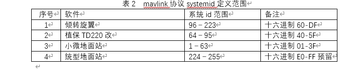
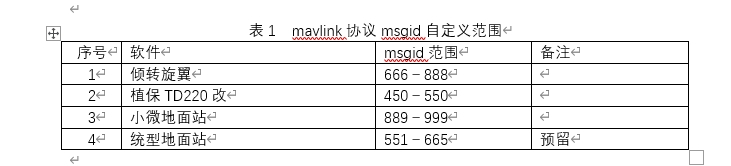

# UAT MAVLINK 标准使用说明

## **原则说明**

为保证最大兼容性common.xml中不允许做任何修改，所有自增功能需要增加交互协议均在standard.xml中进行操作。

xml文件库库由飞控组及应用软件组共同维护，不允许私自增减，需双方对应人员达成一致后做增减操作。

文档编写时间为2022年9月　兼容开源飞控基线为v1.12.3


 补充-2023-2

根据集团地面站统型规范协商补充以下定义要求







## 开源资源介绍

参考以下链接

[MAVSDK开发指南](https://mavlink.io/en/) :mavlink协议基本介绍

[MAVSDK](https://mavsdk.mavlink.io/develop/en/index.html):基于mavlink的SDK库，具有用于[C ++](https://mavsdk.mavlink.io/develop/en/cpp/)，[iOS](http://dronecode-sdk-swift.s3.eu-central-1.amazonaws.com/docs/master/index.html)，Python和Android的API 。

[MAVROS](http://wiki.ros.org/mavros) : MAVROS是ROS官方支持与mavlink设备间通信的ROS package

[MAVLIINK microservices](https://mavlink.io/en/services/): 定义mavlink系统可采用的交互操作协议，(飞控并非所有功能支持,使用前需与飞控开发人员确认当前飞控版本及是否支持实现)

## mavlink开源库目前使用情况

综合目前开发程度，涉及到的改动主要由两方面，messages类型和enums类型，其中enums类型中主要集中在MAV_CMD这一类中。

### messages类型：

目前使用为mavlink2.0版本（向下兼容1.0版本）.

id 1--413 common中已使用（其中180--229是给用户自定义预留），以及部分特殊使用部分（id均大于10000），自用mavlink messages范围180--229。

### enums类型：

MAV_CMD的31000--31999是用户自定义段。

# 飞控状态消息帧说明

#### #1 SYS_STATUS(系统状态)

此帧包含所有传感器实时自检的健康状态及电源的简单信息（电压　电流　剩余百分比，如需更详细电池信息，参考#147）

| 关键条目                        | 内容说明                     |
| ------------------------------- | ---------------------------- |
| onboard_control_sensors_present | 对应传感器或外设是否存在     |
| onboard_control_sensors_enabled | 对应传感器或外设是否使能     |
| onboard_control_sensors_health  | 对应传感器或外设是否健康可用 |
| load                            | cpu占用率(百分比)            |
| voltage_battery                 | 电池电压(0.001V)             |
| current_battery                 | 电池电流(0.01A)              |
| battery_remaining               | 电池容量（百分比）           |

```xml
    <message id="1" name="SYS_STATUS">
      <description>The general system state. If the system is following the MAVLink standard, the system state is mainly defined by three orthogonal states/modes: The system mode, which is either LOCKED (motors shut down and locked), MANUAL (system under RC control), GUIDED (system with autonomous position control, position setpoint controlled manually) or AUTO (system guided by path/waypoint planner). The NAV_MODE defined the current flight state: LIFTOFF (often an open-loop maneuver), LANDING, WAYPOINTS or VECTOR. This represents the internal navigation state machine. The system status shows whether the system is currently active or not and if an emergency occured. During the CRITICAL and EMERGENCY states the MAV is still considered to be active, but should start emergency procedures autonomously. After a failure occured it should first move from active to critical to allow manual intervention and then move to emergency after a certain timeout.</description>
      <field type="uint32_t" name="onboard_control_sensors_present" enum="MAV_SYS_STATUS_SENSOR" display="bitmask" print_format="0x%04x">Bitmask showing which onboard controllers and sensors are present. Value of 0: not present. Value of 1: present. Indices defined by ENUM MAV_SYS_STATUS_SENSOR</field>
      <field type="uint32_t" name="onboard_control_sensors_enabled" enum="MAV_SYS_STATUS_SENSOR" display="bitmask" print_format="0x%04x">Bitmask showing which onboard controllers and sensors are enabled:  Value of 0: not enabled. Value of 1: enabled. Indices defined by ENUM MAV_SYS_STATUS_SENSOR</field>
      <field type="uint32_t" name="onboard_control_sensors_health" enum="MAV_SYS_STATUS_SENSOR" display="bitmask" print_format="0x%04x">Bitmask showing which onboard controllers and sensors are operational or have an error:  Value of 0: not enabled. Value of 1: enabled. Indices defined by ENUM MAV_SYS_STATUS_SENSOR</field>
      <field type="uint16_t" name="load" units="d%">Maximum usage in percent of the mainloop time, (0%: 0, 100%: 1000) should be always below 1000</field>
      <field type="uint16_t" name="voltage_battery" units="mV">Battery voltage, in millivolts (1 = 1 millivolt)</field>
      <field type="int16_t" name="current_battery" units="cA">Battery current, in 10*milliamperes (1 = 10 milliampere), -1: autopilot does not measure the current</field>
      <field type="int8_t" name="battery_remaining" units="%">Remaining battery energy: (0%: 0, 100%: 100), -1: autopilot estimate the remaining battery</field>
      <field type="uint16_t" name="drop_rate_comm" units="c%">Communication drops in percent, (0%: 0, 100%: 10'000), (UART, I2C, SPI, CAN), dropped packets on all links (packets that were corrupted on reception on the MAV)</field>
      <field type="uint16_t" name="errors_comm">Communication errors (UART, I2C, SPI, CAN), dropped packets on all links (packets that were corrupted on reception on the MAV)</field>
      <field type="uint16_t" name="errors_count1">Autopilot-specific errors</field>
      <field type="uint16_t" name="errors_count2">Autopilot-specific errors</field>
      <field type="uint16_t" name="errors_count3">Autopilot-specific errors</field>
      <field type="uint16_t" name="errors_count4">Autopilot-specific errors</field>
    </message>
```

#### #147 BATTERY_STATUS(电池详细信息)

电池id 类型，容量，温度，充电状态等信息

| 关键条目          | 内容说明                 |
| ----------------- | ------------------------ |
| id                | 电池id，用于区分多组电池 |
| temperature       | 电池温度　单位摄氏度     |
| voltages[10]      | 单节电芯电压，单位0.001V |
| current_battery   | 电池电流(0.01A)          |
| battery_remaining | 电池容量（百分比）       |

```xml
    <message id="147" name="BATTERY_STATUS">
      <description>Battery information</description>
      <field type="uint8_t" name="id">Battery ID</field>
      <field type="uint8_t" name="battery_function" enum="MAV_BATTERY_FUNCTION">Function of the battery</field>
      <field type="uint8_t" name="type" enum="MAV_BATTERY_TYPE">Type (chemistry) of the battery</field>
      <field type="int16_t" name="temperature" units="cdegC">Temperature of the battery in centi-degrees celsius. INT16_MAX for unknown temperature.</field>
      <field type="uint16_t[10]" name="voltages" units="mV">Battery voltage of cells, in millivolts (1 = 1 millivolt). Cells above the valid cell count for this battery should have the UINT16_MAX value.</field>
      <field type="int16_t" name="current_battery" units="cA">Battery current, in 10*milliamperes (1 = 10 milliampere), -1: autopilot does not measure the current</field>
      <field type="int32_t" name="current_consumed" units="mAh">Consumed charge, in milliampere hours (1 = 1 mAh), -1: autopilot does not provide mAh consumption estimate</field>
      <field type="int32_t" name="energy_consumed" units="hJ">Consumed energy, in HectoJoules (intergrated U*I*dt)  (1 = 100 Joule), -1: autopilot does not provide energy consumption estimate</field>
      <field type="int8_t" name="battery_remaining" units="%">Remaining battery energy: (0%: 0, 100%: 100), -1: autopilot does not estimate the remaining battery</field>
      <extensions/>
      <field type="int32_t" name="time_remaining" units="s">Remaining battery time, in seconds (1 = 1s = 0% energy left), 0: autopilot does not provide remaining battery time estimate</field>
      <field type="uint8_t" name="charge_state" enum="MAV_BATTERY_CHARGE_STATE">State for extent of discharge, provided by autopilot for warning or external reactions</field>
    </message>
```

#### #24 GPS_RAW_INT(GPS原始数据)

没有经过ekf的位置原始数据

| 关键条目           | 内容说明                                                                                                                                                                                                                             |
| ------------------ | ------------------------------------------------------------------------------------------------------------------------------------------------------------------------------------------------------------------------------------ |
| fix_type           | 定位解算状态<br />0:无gps信号<br />1:有信号未定位<br />2:2D定位状态<br />3:3D定位（单点定位状态，即没有基站存在时，最高为此解算状态）<br />4:伪距差分定位<br />5:RTK浮点解<br />6:RTK固定解（在此解算状态，RTK位置精度达到使用要求） |
| lat、lon           | WGS84坐标系　经纬度　10E-7                                                                                                                                                                                                           |
| alt                | 海拔高度　0.001m                                                                                                                                                                                                                     |
| eph、epv           | HDOP VDOP　水平、垂直精度因子                                                                                                                                                                                                        |
| vel                | gps速度，标量无方向　单位m/s                                                                                                                                                                                                         |
| satellites_visible | 可观测卫星数量                                                                                                                                                                                                                       |
| alt_ellipsoid      | WGS84　椭球高度　单位0.001m                                                                                                                                                                                                          |

```xml
    <message id="24" name="GPS_RAW_INT">
      <description>The global position, as returned by the Global Positioning System (GPS). This is
                NOT the global position estimate of the system, but rather a RAW sensor value. See message GLOBAL_POSITION for the global position estimate.</description>
      <field type="uint64_t" name="time_usec" units="us">Timestamp (microseconds since UNIX epoch or microseconds since system boot)</field>
      <field type="uint8_t" name="fix_type" enum="GPS_FIX_TYPE">See the GPS_FIX_TYPE enum.</field>
      <field type="int32_t" name="lat" units="degE7">Latitude (WGS84, EGM96 ellipsoid), in degrees * 1E7</field>
      <field type="int32_t" name="lon" units="degE7">Longitude (WGS84, EGM96 ellipsoid), in degrees * 1E7</field>
      <field type="int32_t" name="alt" units="mm">Altitude (AMSL, NOT WGS84), in meters * 1000 (positive for up). Note that virtually all GPS modules provide the AMSL altitude in addition to the WGS84 altitude.</field>
      <field type="uint16_t" name="eph">GPS HDOP horizontal dilution of position (unitless). If unknown, set to: UINT16_MAX</field>
      <field type="uint16_t" name="epv">GPS VDOP vertical dilution of position (unitless). If unknown, set to: UINT16_MAX</field>
      <field type="uint16_t" name="vel" units="cm/s">GPS ground speed (m/s * 100). If unknown, set to: UINT16_MAX</field>
      <field type="uint16_t" name="cog" units="cdeg">Course over ground (NOT heading, but direction of movement) in degrees * 100, 0.0..359.99 degrees. If unknown, set to: UINT16_MAX</field>
      <field type="uint8_t" name="satellites_visible">Number of satellites visible. If unknown, set to 255</field>
      <extensions/>
      <field type="int32_t" name="alt_ellipsoid" units="mm">Altitude (above WGS84, EGM96 ellipsoid), in meters * 1000 (positive for up).</field>
      <field type="uint32_t" name="h_acc" units="mm">Position uncertainty in meters * 1000 (positive for up).</field>
      <field type="uint32_t" name="v_acc" units="mm">Altitude uncertainty in meters * 1000 (positive for up).</field>
      <field type="uint32_t" name="vel_acc" units="mm">Speed uncertainty in meters * 1000 (positive for up).</field>
      <field type="uint32_t" name="hdg_acc" units="degE5">Heading / track uncertainty in degrees * 1e5.</field>
    </message>
```

#### #32 LOCAL_POSITION(无人机相对位置)

飞控实际使用的位置和速度数据，基于ＮＥＤ坐标系，坐标系原点为上电后导航定位首次收敛定位成功的坐标

| 关键条目   | 内容说明                                               |
| ---------- | ------------------------------------------------------ |
| X、Y、Z    | 导航坐标系（NED）下位置　单位m参考点为无人机收敛定位点 |
| VX、VY、VZ | 导航坐标系（NED）下速度 　单位m/s                      |

```xml
    <message id="32" name="LOCAL_POSITION_NED">
      <description>The filtered local position (e.g. fused computer vision and accelerometers). Coordinate frame is right-handed, Z-axis down (aeronautical frame, NED / north-east-down convention)</description>
      <field type="uint32_t" name="time_boot_ms" units="ms">Timestamp (milliseconds since system boot)</field>
      <field type="float" name="x" units="m">X Position</field>
      <field type="float" name="y" units="m">Y Position</field>
      <field type="float" name="z" units="m">Z Position</field>
      <field type="float" name="vx" units="m/s">X Speed</field>
      <field type="float" name="vy" units="m/s">Y Speed</field>
      <field type="float" name="vz" units="m/s">Z Speed</field>
    </message>
```

#### #33 GLOBAL_POSITION(无人机绝对位置)

无人机控制器实际使用的位置和速度数据，基于WGS84

| 关键条目   | 内容说明                             |
| ---------- | ------------------------------------ |
| lat lon    | WGS84坐标系　经纬度　10E-7           |
| alt        | WGS84坐标系　高度（椭球高）0.001m    |
| vx、vy、vz | 速度，WGS坐标系下速度，近似NED系方向 |
| hdg        | 无人机航向，基本不使用               |

```xml
    <message id="33" name="GLOBAL_POSITION_INT">
      <description>The filtered global position (e.g. fused GPS and accelerometers). The position is in GPS-frame (right-handed, Z-up). It
               is designed as scaled integer message since the resolution of float is not sufficient.</description>
      <field type="uint32_t" name="time_boot_ms" units="ms">Timestamp (milliseconds since system boot)</field>
      <field type="int32_t" name="lat" units="degE7">Latitude, expressed as degrees * 1E7</field>
      <field type="int32_t" name="lon" units="degE7">Longitude, expressed as degrees * 1E7</field>
      <field type="int32_t" name="alt" units="mm">Altitude in meters, expressed as * 1000 (millimeters), AMSL (not WGS84 - note that virtually all GPS modules provide the AMSL as well)</field>
      <field type="int32_t" name="relative_alt" units="mm">Altitude above ground in meters, expressed as * 1000 (millimeters)</field>
      <field type="int16_t" name="vx" units="cm/s">Ground X Speed (Latitude, positive north), expressed as m/s * 100</field>
      <field type="int16_t" name="vy" units="cm/s">Ground Y Speed (Longitude, positive east), expressed as m/s * 100</field>
      <field type="int16_t" name="vz" units="cm/s">Ground Z Speed (Altitude, positive down), expressed as m/s * 100</field>
      <field type="uint16_t" name="hdg" units="cdeg">Vehicle heading (yaw angle) in degrees * 100, 0.0..359.99 degrees. If unknown, set to: UINT16_MAX</field>
    </message>
```
# 飞控模式设置消息帧说明

在切换任务模式或返航模式时，如果需要选择不同的任务恢复点或返航点时，使用这条命令替代SET_MODE命令

```xml
<message id="905" name="UAT_SET_MODE">
      <description>Set the system mode, as defined by enum MAV_MODE. There is no target component id as the mode is by definition for the overall aircraft, not only for one component.</description>
      <field type="uint8_t" name="target_system">The system setting the mode</field>
      <field type="uint8_t" name="base_mode" enum="MAV_MODE">The new base mode.</field>
      <field type="uint8_t" name="point_type" >Mission:enum UAT_MISSION_RESUM_POINT_TYPE,RTL::enum UAT_RTL_POINT_TYPE</field>
      <field type="uint32_t" name="custom_mode">The new autopilot-specific mode. This field can be ignored by an autopilot.</field>
    </message>
```
| 关键条目                      | 说明                                                         |
| ----------------------------- | ------------------------------------------------------------ |
| point_type                    | 在切换到任务模式时，表示该任务从哪个点恢复执行，详见枚举 UAT_MISSION_RESUME_POINT_TYPE<br /><br />在切换到返航模式时，表示返航到哪个点，详见枚举 UAT_RTL_POINT_TYPE |
| UAT_MISSION_RESUME_POINT_TYPE | 任务恢复点枚举   0：正常执行 1：垂点1  2：垂点2  3：断点     |
| UAT_RTL_POINT_TYPE            | 返航点枚举        0：home点  1：中转点                       |
```xml
    <enum name="UAT_MISSION_RESUME_POINT_TYPE">
      <description>mission resume point type </description>
      <entry value="0" name="MISSION_RESUME_POINT_NONE">
        <description> </description>
      </entry>
      <entry value="1" name="MISSION_RESUME_POINT_FOOT1">
        <description> </description>
      </entry>
      <entry value="2" name="MISSION_RESUME_POINT_FOOT2">
        <description> </description>
      </entry>
      <entry value="3" name="MISSION_RESUME_POINT_BREAK">
        <description> </description>
      </entry>
    </enum> 
```
```xml
    <enum name="UAT_RTL_POINT_TYPE">
      <description>rtl point type </description>
      <entry value="0" name="RTL_POINT_NONE">
        <description> </description>
      </entry>
      <entry value="1" name="RTL_POINT_TRANSFER">
        <description> </description>
      </entry>
    </enum> 
```
# 飞控指令消息帧说明

### #75 COMMAND_INT

### #76 COMMAND_LONG

指令可分为整形和浮点型两条消息，均可使用，赋值时需要注意即可，整形消息赋值时需将浮点型转换为保证最小精度的整形数。

```xml
    <message id="75" name="COMMAND_INT">
      <description>Message encoding a command with parameters as scaled integers. Scaling depends on the actual command value.</description>
      <field type="uint8_t" name="target_system">System ID</field>
      <field type="uint8_t" name="target_component">Component ID</field>
      <field type="uint8_t" name="frame" enum="MAV_FRAME">The coordinate system of the COMMAND, as defined by MAV_FRAME enum</field>
      <field type="uint16_t" name="command" enum="MAV_CMD">The scheduled action for the mission item, as defined by MAV_CMD enum</field>
      <field type="uint8_t" name="current">false:0, true:1</field>
      <field type="uint8_t" name="autocontinue">autocontinue to next wp</field>
      <field type="float" name="param1">PARAM1, see MAV_CMD enum</field>
      <field type="float" name="param2">PARAM2, see MAV_CMD enum</field>
      <field type="float" name="param3">PARAM3, see MAV_CMD enum</field>
      <field type="float" name="param4">PARAM4, see MAV_CMD enum</field>
      <field type="int32_t" name="x">PARAM5 / local: x position in meters * 1e4, global: latitude in degrees * 10^7</field>
      <field type="int32_t" name="y">PARAM6 / local: y position in meters * 1e4, global: longitude in degrees * 10^7</field>
      <field type="float" name="z">PARAM7 / z position: global: altitude in meters (relative or absolute, depending on frame.</field>
    </message>
```

以下通过设置模式举例说明，

#### #176 MAV_CMD_DO_SET_MODE(设置飞行模式)

```xml
      <entry value="176" name="MAV_CMD_DO_SET_MODE">
        <description>Set system mode.</description>
        <param index="1">Mode, as defined by ENUM MAV_MODE</param>
        <param index="2">Custom mode - this is system specific, please refer to the individual autopilot specifications for details.</param>
        <param index="3">Custom sub mode - this is system specific, please refer to the individual autopilot specifications for details.</param>
        <param index="4">Empty</param>
        <param index="5">Empty</param>
        <param index="6">Empty</param>
        <param index="7">Empty</param>
      </entry>
```

使用mavlink　message id="75"或　message id="76"，消息帧发送　MAV_CMD = MAV_CMD_DO_SET_MODE的指令进行模式切换，下表为切换详细举例,mavlink发送消息只需填充对应参数2(custorm_mode)即可。

飞控端会将mavlink发送的custom_mode解析成对应的base_mode ,main_mode,sub_mode执行切换逻辑（地面站对接工作了解此过程即可）。

|                       |              | base\_mode | custom\_main\_mode | custom\_sub\_mode |
| --------------------- | ------------ | ---------- | ------------------ | ----------------- |
|                       |              | param1     | param2             | param3            |
|                       | custom\_mode | base\_mode | main\_mode         | sub\_mode         |
| 手动                  | 65536        | 1          | 1                  | 0                 |
| 自稳                  | 458752       | 1          | 7                  | 0                 |
| 特技（暂时不用）      | 327680       | 1          | 5                  | 0                 |
| rattitude（暂时不用） | 524288       | 1          | 8                  | 0                 |
| 定高                  | 131072       | 1          | 2                  | 0                 |
| 机载电脑              | 393216       | 1          | 6                  | 0                 |
| 定点                  | 196608       | 1          | 3                  | 0                 |
| 悬停                  | 50593792     | 1          | 4                  | 3                 |
| 任务模式（航线模式）  | 67371008     | 1          | 4                  | 4                 |
| 返航模式              | 84148224     | 1          | 4                  | 5                 |
| 跟随模式（暂时不用）  | 134479872    | 1          | 4                  | 8                 |

**mavlink标准对切换模式枚举定义**

```xml
enum PX4_CUSTOM_MAIN_MODE {
PX4_CUSTOM_MAIN_MODE_MANUAL = 1,
PX4_CUSTOM_MAIN_MODE_ALTCTL,
PX4_CUSTOM_MAIN_MODE_POSCTL,
PX4_CUSTOM_MAIN_MODE_AUTO,
PX4_CUSTOM_MAIN_MODE_ACRO,
PX4_CUSTOM_MAIN_MODE_OFFBOARD,
PX4_CUSTOM_MAIN_MODE_STABILIZED,
PX4_CUSTOM_MAIN_MODE_RATTITUDE,
PX4_CUSTOM_MAIN_MODE_SIMPLE /* unused, but reserved for future use */
};


enum PX4_CUSTOM_SUB_MODE_AUTO {
PX4_CUSTOM_SUB_MODE_AUTO_READY = 1,
PX4_CUSTOM_SUB_MODE_AUTO_TAKEOFF,
PX4_CUSTOM_SUB_MODE_AUTO_LOITER,
PX4_CUSTOM_SUB_MODE_AUTO_MISSION,
PX4_CUSTOM_SUB_MODE_AUTO_RTL,
PX4_CUSTOM_SUB_MODE_AUTO_LAND,
PX4_CUSTOM_SUB_MODE_AUTO_RTGS,
PX4_CUSTOM_SUB_MODE_AUTO_FOLLOW_TARGET,
PX4_CUSTOM_SUB_MODE_AUTO_PRECLAND
};
```


#### #21 MAV_CMD_NAV_LAND(降落)

```
<entry value="21" name="MAV_CMD_NAV_LAND" hasLocation="true" isDestination="true">
<description>Land at location.</description>
<param index="1" label="Abort Alt" units="m">Minimum target altitude if landing is aborted (0 = undefined/use system default).</param>
<param index="2" label="Land Mode" enum="PRECISION_LAND_MODE">Precision land mode.</param>
<param index="3">Empty.</param>
<param index="4" label="Yaw Angle" units="deg">Desired yaw angle. NaN to use the current system yaw heading mode (e.g. yaw towards next waypoint, yaw to home, etc.).</param>
<param index="5" label="Latitude">Latitude.</param>
<param index="6" label="Longitude">Longitude.</param>
<param index="7" label="Altitude" units="m">Landing altitude (ground level in current frame).</param>
</entry>
```

| 关键条目 | 内容说明                                                     |
| -------- | ------------------------------------------------------------ |
| param1   |                                                              |
| param2   | 如rtl_pld_md参数含义一致：是否开启精准降落以及模式设置。常用：2 |
| param3   | 指定二维码编号                                               |
| param4   | 航向                                                         |


#### #22 MAV_CMD_NAV_TAKEOFF(起飞)

通常起飞时只会指定目标起飞高度，其余未使用字段赋值为NAN即可（NAN不等于0）

| 关键条目 | 内容说明                                              |
| -------- | ----------------------------------------------------- |
| param4   | 目标起飞航向，一般起飞保持当前航向此参数赋值为NAN即可 |
| param５  | 目标纬度                                              |
| param6   | 目标经度                                              |
| param7   | 目标高度                                              |

```xml
      <entry value="22" name="MAV_CMD_NAV_TAKEOFF" hasLocation="true" isDestination="true">
        <description>Takeoff from ground / hand. Vehicles that support multiple takeoff modes (e.g. VTOL quadplane) should take off using the currently configured mode.</description>
        <param index="1" label="Pitch" units="deg">Minimum pitch (if airspeed sensor present), desired pitch without sensor</param>
        <param index="2">Empty</param>
        <param index="3">Empty</param>
        <param index="4" label="Yaw" units="deg">Yaw angle (if magnetometer present), ignored without magnetometer. NaN to use the current system yaw heading mode (e.g. yaw towards next waypoint, yaw to home, etc.).</param>
        <param index="5" label="Latitude">Latitude</param>
        <param index="6" label="Longitude">Longitude</param>
        <param index="7" label="Altitude" units="m">Altitude</param>
      </entry>
```
#### #31023 UAT_CMD_DO_SET_TRANSFER_POINT(设置中转点)

该命令通常在航线上放置在中转点的后面，设置其为中转点（use_current 为1）

也保留支持用户使用这条命令设置指定中转点（use_current 为0）

| 关键条目    | 内容说明                                                |
| ----------- | ------------------------------------------------------- |
| use_current | 1: 使用当前点为中转点 0：使用指定点，指点坐标为下面三个 |
| latitude    | 纬度                                                    |
| longitude   | 经度                                                    |
| altitude    | 高度                                                    |

```xml
<entry value="31023" name="UAT_CMD_DO_SET_TRANSFER_POINT">
        <description>set transfer point</description>
        <param index="1" label="use_current">Use current (1=use current location, 0=use specified location)</param>
        <param index="2" >Empty</param>
        <param index="3" >Empty</param>
        <param index="4" >Empty </param>
        <param index="5" label="latitude">Empty</param>
        <param index="6" label="longitude">Empty</param>
        <param index="7" label="altitude">m</param>
      </entry>
```
# 吊舱消息帧说明（UAT新增）

### mav设备号

|      | 吊仓设备号                              | 地址                    | 总线                    | 总线类型                |
| ---- | --------------------------------------- | ----------------------- | ----------------------- | ----------------------- |
| 长度 | devtype （8bit）                        | address （8bit）        | bus（5bit）             | bustype （3bit）        |
| 说明 | 设备号区分吊仓<br />参考如下devtype表格 | 地面站可忽略，等于0即可 | 地面站可忽略，等于2即可 | 地面站可忽略，等于2即可 |

#### devtype

| 设备名          | 吊仓设备号 | MAV设备号 |
| --------------- | ---------- | --------- |
| A30TR（三光）   | 51         | 3342355   |
| ZT40 （双光）   | 52         | 3407891   |
| A10T（双光）    | 53         | 3473427   |
| ZT30  (四光)    | 54         | 3538963   |
| GL60P（探照灯） | 60         | 3932179   |
| TH4C (抛投)     | 61         | 3997715   |

### 地面站->吊舱透传

#### #180 UAT_MAV2UAVCAN

| 关键条目  | 内容说明           |
| --------- | ------------------ |
| device_id | 用于标识目标设备   |
| valid_len | 数组中有效数据长度 |
| buf[238]  | 数据               |

### 吊舱->地面站透传

#### #181 UAT_UAVCAN2MAV

| 关键条目  | 内容说明           |
| --------- | ------------------ |
| device_id | 用于标识目标设备   |
| valid_len | 数组中有效数据长度 |
| buf[250]  | 数据               |

```xml
    <message id="180" name="UAT_MAV2UAVCAN">
    <description>GCS mavlink to UAVCAN</description>
		<field type="uint32_t[4]" name="device_id">target payload id</field>
		<field type="uint8_t"     name="valid_len">valid length of buf</field>
    <field type="uint8_t[238]" name="buf">buf</field>
    </message>

    <message id="181" name="UAT_UAVCAN2MAV">
    <description>GCS mavlink to UAVCAN</description>
		<field type="uint32_t"    name="device_id" >payload id</field>
		<field type="uint8_t"     name="valid_len">valid length of buf</field>
    <field type="uint8_t[250]" name="buf">buf</field>
    </message>
```

### 吊舱状态反馈

#### #184 UAT_MOUNT_STATUS

| 关键条目   | 内容说明                       |
| ---------- | ------------------------------ |
| pitch      | 吊舱实时俯仰角度               |
| yaw        | 吊舱实时偏航角度               |
| mount_mode | 吊舱模式　参考　UAT_MOUNT_MODE |

```xml
    <message id="184" name="UAT_MOUNT_STATUS">
      <description> send mount status in fix frequency</description>
      <field type="uint32_t" name="device_id">payload id</field>
      <field type="int16_t" name="pitch">Empty </field>
      <field type="int16_t" name="roll">Empty </field>
      <field type="int16_t" name="yaw">Empty </field>
      <field type="uint8_t" name="mount_mode">reference enum UAT_MOUNT_MODE </field>
    </message>

    <enum name="UAT_MOUNT_MODE">
      <description>mount command type and description</description>
      <entry value="1" name="MODE_FIX_YAW">
        <description> fix gimbal absolute yaw</description>
      </entry>
      <entry value="2" name="MODE_FOLLOW_YAW">
        <description>gimbal yaw follow with vehicle</description>
      </entry>
    </enum>
```

### 相机状态反馈

#### #193 UAT_CAMERA_STATUS

| 关键条目           | 内容说明                                                                   |
| ------------------ | -------------------------------------------------------------------------- |
| visible_state      | 可见光相机状态 bit[0]:enable/disable  bit[1:7]可见光类型 参考枚举VISIBLE_TYPE |
| ir_state           | 红外相机状态bit[0]:enable/disable bit[1:7] 色板类型 参考枚举IR_PALETTES    |
| laser_state        | 激光器状态 bit[0]:enable/disable                                           |
| visible_zoom       | 可见光变焦倍数 当前倍数*10                                                 |
| ir_zoom            | 红外变焦倍数 当前倍数*10                                                   |
| laser_distance     | 激光测距结果 单位m                                                         |
| camera_state       | 相机状态  bit[0]:录像状态标识 视频流组合类型 bit[1:3]  参考枚举STREAM_TYPE |
| target_lon_deg_1e7 | 目标纬度                                                                   |
| target_lat_deg_1e7 | 目标经度                                                                   |

```xml
    <message id="193" name="UAT_CAMERA_STATUS">
      <description>camera status to gcs </description>
      <field type="uint8_t" name="visible_state">bit[0]:output enable/disable bit[1:7]:enum VISIBLE_TYPE</field>
      <field type="uint8_t" name="ir_state">bit[0]:output enable/disable bit[1:7]:enum IR_PALETTES</field>
      <field type="uint8_t" name="laser_state">bit[0]:output enable/disable </field>
      <field type="uint16_t" name="visible_zoom">visible zoom number * 10 </field>
      <field type="uint16_t" name="ir_zoom">ir zoom number * 10 </field>
      <field type="uint16_t" name="laser_distance">distance unit:m </field>
       <field type="uint8_t" name="camera_state">bit[0]:recording bit[1:3] stream_type </field>
    </message>
    
    <enum name="VISIBLE_TYPE">
      <description>visible_type</description>
      <entry value="0" name="VISIBLE_COMMON">
        <description>common mode</description>
      </entry>
      <entry value="1" name="VISIBLE_DEFOG">
        <description>light fog mode</description>
      </entry>
      <entry value="2" name="VISIBLE_IRCUT">
        <description>ir-cut mode</description>
      </entry>
    </enum> 

    <enum name="IR_PALETTES">
      <description>Colour Palettes of ir camera</description>
      <entry value="0" name="IR_IRON">
        <description>empty</description>
      </entry>
      <entry value="1" name="IR_BLACK">
        <description>empty</description>
      </entry>
      <entry value="2" name="IR_WRITE">
        <description>empty</description>
      </entry>
      <entry value="3" name="IR_GREY">
        <description>empty</description>
      </entry>
      <entry value="4" name="IR_RAINBOW">
        <description>empty</description>
      </entry>
      <entry value="5" name="IR_SEPIA">
        <description>empty</description>
      </entry>
      <entry value="6" name="IR_NIGHT">
        <description>empty</description>
      </entry>
      <entry value="7" name="IR_AURORA">
        <description>empty</description>
      </entry>
      <entry value="8" name="IR_REDHOT">
        <description>empty</description>
      </entry>
      <entry value="9" name="IR_JUNGLE">
        <description>empty</description>
      </entry>
      <entry value="10" name="IR_MEDICAL">
        <description>empty</description>
      </entry>
      <entry value="11" name="IR_GLORY">
        <description>empty</description>
      </entry>
    </enum> 
    <enum name="STREAM_TYPE">
      <description>mount command type and description</description>
      <entry value="0" name="STREAM_TYPE_VISIBLE_ONLY">
        <description>empty</description>
      </entry>
      <entry value="1" name="STREAM_TYPE_IR_ONLY">
        <description>empty</description>
      </entry>
      <entry value="2" name="STREAM_TYPE_IR_IN_VISIBLE">
        <description>empty</description>
      </entry>
      <entry value="3" name="STREAM_TYPE_VISIBLE_IN_IR">
        <description>empty</description>
      </entry>
      <entry value="4" name="STREAM_TYPE_VISIBLE_WITH_IR">
        <description>empty</description>
      </entry>
    </enum>
```

### 吊舱识别反馈

#### #185 UAT_RECOGNIZE_STATUS

当有目标识别时，周期发送（每个目标不低于1hz发送）

识别目标为n时，此消息发送周期为nhz,所有目标周期轮循。

| 关键条目                                                           | 内容说明         |
| ------------------------------------------------------------------ | ---------------- |
| target_id                                                          | 识别目标id       |
| rec_type                                                           | 识别目标类型     |
| rec_confidence                                                     | 识别目标置信度   |
| rectangle_x1<br />rectangle_y1<br />rectangle_x2<br />rectangle_y2 | 识别选框像素坐标 |

```xml
    <message id="185" name="UAT_RECOGNIZE_STATUS">
      <description> recognize</description>
      <field type="uint32_t" name="device_id" >payload id</field>
      <field type="uint8_t"  name="target_id"> </field>
      <field type="uint8_t"  name="rec_type"> </field>
      <field type="float"    name="rec_confidence"> </field>
      <field type="float"    name="rectangle_x1">empty </field>
      <field type="float"    name="rectangle_y1">empty </field>
      <field type="float"    name="rectangle_x2">empty </field>
      <field type="float"    name="rectangle_y2">empty </field>
    </message>
```

### 吊舱识别反馈

#### #186 UAT_TRACK_STATUS

当处于追踪状态时，周期发送，5hz，

| 关键条目                                                           | 内容说明                               |
| ------------------------------------------------------------------ | -------------------------------------- |
| target_id                                                          | 识别目标id（如果是识别状态）           |
| track_state                                                        | 追踪状态，参考AITRACK_STATE            |
| rec_type                                                           | 追踪目标的识别类型（如果是识别状态）   |
| rec_confidence                                                     | 追踪目标的识别置信度（如果是识别状态） |
| rectangle_x1<br />rectangle_y1<br />rectangle_x2<br />rectangle_y2 | 识别选框像素坐标                       |
| latitude<br />longitude<br />alt                                   | 目标绝对位置　精度厘米                 |

```xml
    <message id="186" name="UAT_TRACK_STATUS">
      <description> recognize and track state</description>
      <field type="uint32_t" name="device_id" >payload id</field>
      <field type="uint8_t"  name="target_id"> </field>
      <field type="uint8_t"  name="track_state"> enum AITRACK_STATE </field>
      <field type="uint8_t"  name="rec_type"> </field>
      <field type="float"    name="rec_confidence"> </field>
      <field type="float"    name="rectangle_x1">empty </field>
      <field type="float"    name="rectangle_y1">empty </field>
      <field type="float"    name="rectangle_x2">empty </field>
      <field type="float"    name="rectangle_y2">empty </field>
      <field type="int32_t"  name="latitude">latitude in degrees * 10^7 </field>
      <field type="int32_t"  name="longitude">longitude in degrees * 10^7 </field>
      <field type="int16_t"  name="alt">alt meter * 10^2</field>
 
  
    <enum name="AITRACK_STATE">
      <description>mount command type and description</description>
      <entry value="0" name="AITRACK_STATE_IDLE">
        <description>empty</description>
      </entry>
      <entry value="1" name="AITRACK_STATE_SEARCH">
        <description>empty</description>
      </entry>
      <entry value="2" name="AITRACK_STATE_TRACKING">
        <description>empty</description>
      </entry>
      <entry value="3" name="AITRACK_STATE_LOST">
        <description>empty</description>
      </entry>
    </enum>
```

## 吊舱指令帧

#### #182 UAT_MOUNT_CONTROL

#### #183 UAT_MOUNT_CONTROL_ACK

```xml
    <message id="182" name="UAT_MOUNT_CONTROL">
      <description>UAT_MOUNT_CONTROL</description>
      <field type="uint32_t" name="device_id" >payload id</field>
      <field type="uint16_t" name="command"> </field>
      <field type="int32_t"  name="param1"> </field>
      <field type="int32_t"  name="param2"> </field>
      <field type="int32_t"  name="param3"> </field>
      <field type="float"    name="param4"> </field>
      <field type="float"    name="param5"> </field>
      <field type="float"    name="param6"> </field>
    </message>
```

只有部分需要控制响应的指令使用以下ACK

例如指点测温等

```xml
    <message id="183" name="UAT_MOUNT_CONTROL_ACK">
      <description>UAT_MOUNT_CONTROL_ACK</description>
      <field type="uint32_t" name="device_id" >payload id</field>
      <field type="uint16_t" name="command" enum="UAT_MOUNT_CMD">Empty </field>
      <field type="int32_t"  name="param1">Empty </field>
      <field type="int32_t"  name="param2">Empty </field>
      <field type="int32_t"  name="param3">Empty </field>
      <field type="float"    name="param4">Empty </field>
      <field type="float"    name="param5">Empty </field>
      <field type="float"    name="param6">Empty </field>
    </message>
```

| 关键条目  | 内容说明                                                                   |
| --------- | -------------------------------------------------------------------------- |
| device_id | 用于标识目标设备                                                           |
| command   | 用于标识指令类型                                                           |
| param     | param1--param3为整形数据，param4--param6为浮点型数据，具体参考对应指令说明 |

### 吊舱控制-ORIGIN

#### #205 MAV_CMD_DO_MOUNT_CONTROL

| 关键条目 | 内容说明                                      |
| -------- | --------------------------------------------- |
| Pitch    | 云台俯仰角度控制　等效于#2 CTL_MOUNT_ATTITUDE |
| Yaw      | 云台航向角度控制　等效于#2 CTL_MOUNT_ATTITUDE |
| Mode     | 吊舱模式　#1 SET_MOUNT_MODE                   |

```xml
      <entry value="205" name="MAV_CMD_DO_MOUNT_CONTROL" hasLocation="false" isDestination="false">
        <deprecated since="2020-01" replaced_by="MAV_CMD_DO_GIMBAL_MANAGER_PITCHYAW">This message is ambiguous and inconsistent. It has been superseded by MAV_CMD_DO_GIMBAL_MANAGER_PITCHYAW and MAV_CMD_DO_SET_ROI_*. The message can still be used to communicate with legacy gimbals implementing it.</deprecated>
        <description>Mission command to control a camera or antenna mount</description>
        <param index="1" label="Pitch">pitch depending on mount mode (degrees or degrees/second depending on pitch input).</param>
        <param index="2" label="Roll">roll depending on mount mode (degrees or degrees/second depending on roll input).</param>
        <param index="3" label="Yaw">yaw depending on mount mode (degrees or degrees/second depending on yaw input).</param>
        <param index="4" label="Altitude" units="m">altitude depending on mount mode.</param>
        <param index="5" label="Latitude">latitude, set if appropriate mount mode.</param>
        <param index="6" label="Longitude">longitude, set if appropriate mount mode.</param>
        <param index="7" label="Mode" enum="MAV_MOUNT_MODE">Mount mode.</param>
      </entry>
```

#### #203 MAV_CMD_DO_DIGICAM_CONTROL

| 关键条目      | 内容说明                             |
| ------------- | ------------------------------------ |
| Shoot Command | 触发拍照　等效于#4 CAPTURE_CONTROL   |
| Zoom Absolute | 变焦控制　位置　等效于#6 CAMERA_ZOOM |
| Zoom Relative | 变焦控制　增量　等效于#6 CAMERA_ZOOM |


#### #30001 UAT_HALYARD_CONTROL

| 关键条目 | 内容说明                         |
| -------- | -------------------------------- |
| mode     | 0:空闲 <br />1:回收 <br />2:释放 |


#### #30002 UAT_THROW_CONTROL

| 关键条目 | 内容说明                                                     |
| -------- | ------------------------------------------------------------ |
| release  | 释放控制bitmask<br />每个bit表示抛投一个位置，最多支持8段抛投异步控制 |


### 云台工作模式控制

#### #1 SET_MOUNT_MODE

| 关键条目 | 内容说明        |
| -------- | --------------- |
| mode     | 1: 锁头　2:跟随 |

```xml
      <entry value="1" name="SET_MOUNT_MODE">
        <description>set mount mode</description>
        <param index="1" label="mode" enum="UAT_MOUNT_MODE">Empty</param>
        <param index="2" label="param2">Empty</param>
        <param index="3" label="param3">Empty</param>
        <param index="4" label="param4">Empty</param>
        <param index="5" label="param5">Empty</param>
        <param index="6" label="param6">Empty</param>
        <param index="7" label="param7">Empty</param>
      </entry>


    <enum name="UAT_MOUNT_MODE">
      <description>mount command type and description</description>
      <entry value="1" name="MODE_FIX_YAW">
        <description> fix gimbal absolute yaw</description>
      </entry>
      <entry value="2" name="MODE_FOLLOW_YAW">
        <description>gimbal yaw follow with vehicle</description>
      </entry>
    </enum>
```

### 角度控制

#### #2 CTL_MOUNT_ATTITUDE

| 关键条目   | 内容说明                       |
| ---------- | ------------------------------ |
| pitch　yaw | 目标角度　单位degrees 精度0.01 |

```xml
      <entry value="2" name="CTL_MOUNT_ATTITUDE">
        <description>mount attitude control</description>
        <param index="1" label="pitch">degrees * 10^2 </param>
        <param index="2" label="yaw">degrees * 10^2</param>
        <param index="3" label="param3">Empty</param>
        <param index="4" label="param4">Empty</param>
        <param index="5" label="param5">Empty</param>
        <param index="6" label="param6">Empty</param>
        <param index="7" label="param7">Empty</param>
      </entry>
```

### 角速度控制

#### #3 CTL_MOUNT_RATE

有外部输出时需持续发送 频率5hz

| 关键条目   | 内容说明                               |
| ---------- | -------------------------------------- |
| pitch　yaw | 目标角速度　最大为10  正负区分运动方向 |

```xml
      <entry value="3" name="CTL_MOUNT_RATE">
        <description>mount angle speed control </description>
        <param index="1" label="pitch" minValue="-10" maxValue="10">scale with control input</param>
        <param index="2" label="yaw" minValue="-10" maxValue="10">scale with control input</param>
        <param index="3" label="param3">Empty</param>
        <param index="4" label="param4">Empty</param>
        <param index="5" label="param5">Empty</param>
        <param index="6" label="param6">Empty</param>
        <param index="7" label="param7">Empty</param>
      </entry>
```

### 拍照控制

#### #4 CAPTURE_CONTROL

```xml
      <entry value="4" name="CAPTURE_CONTROL">
        <description>set mount mode</description>
        <param index="1" label="enable">Empty</param>
        <param index="2" label="param2">Empty</param>
        <param index="3" label="param3">Empty</param>
        <param index="4" label="param4">Empty</param>
        <param index="5" label="param5">Empty</param>
        <param index="6" label="param6">Empty</param>
        <param index="7" label="param7">Empty</param>
      </entry>
```

### 录像控制

#### #5 VEDIO_CONTROL

```xml
      <entry value="5" name="VEDIO_CONTROL">
        <description>set mount mode</description>
        <param index="1" label="enable">Empty</param>
        <param index="2" label="param2">Empty</param>
        <param index="3" label="param3">Empty</param>
        <param index="4" label="param4">Empty</param>
        <param index="5" label="param5">Empty</param>
        <param index="6" label="param6">Empty</param>
        <param index="7" label="param7">Empty</param>
      </entry>
```

### 变焦控制

#### #6 CAMERA_ZOOM

| 关键条目 | 内容说明     |
| -------- | ------------ |
| zoom_num | 指定变焦倍数 |

```xml
      <entry value="6" name="CAMERA_ZOOM">
        <description> camera zoom control</description>
        <param index="1" label="zoom_num">0--40 * 10</param>
        <param index="2" label="param2">Empty</param>
        <param index="3" label="param3">Empty</param>
        <param index="4" label="param4">Empty</param>
        <param index="5" label="param5">Empty</param>
        <param index="6" label="param6">Empty</param>
        <param index="7" label="param7">Empty</param>
      </entry>  
```

### 画面及色板切换

#### #7 IMAGE_SWITCH

| 关键条目       | 内容说明                                         |
| -------------- | ------------------------------------------------ |
| visible_enable | bit[0]:可见光输出使能　                         |
| VISIBLE_TYPE   | 可见光类型　通用　透雾　IRCUT等                  |
| ir_enable      | bit[0]:红外输出使能　　bit[1]:标识红外为主画面   |
| ir_type        | 红外色板类型　红热　白热　黑热等                 |

```xml
      <entry value="7" name="IMAGE_SWITCH">
        <description>switch ir or visible image</description>
        <param index="1" label="visible_enable">bit[0]:output enable/disable bit[1:7]:enum VISIBLE_TYPE</param>
        <param index="2" label="ir_enable">bit[0]:output enable/disable bit[1:7]:ir_type</param>
        <param index="3" label="stream_type">reference enum STREAM_TYPE</param>
        <param index="4" label="laser_enable">bit[0]:output enable/disable</param>
        <param index="5" label="param5">Empty</param>
        <param index="6" label="param6">Empty</param>
        <param index="7" label="param7">Empty</param>
      </entry>
```

### 指点控制

#### #8 CONTROL_POINT

| 关键条目 | 内容说明                                                                 |
| -------- | ------------------------------------------------------------------------ |
| pix_x    | 像素坐标x，取值范围缩放为-1~1,画幅水平为x 右为正                         |
| pix_y    | 像素坐标y，取值范围缩放为-1~1,画幅垂直y 上为正                           |
| mode     | 指点控制模式　参考取值CTL_POINT_MODE　例如指点移动　指点测温　指点追踪等 |

```xml
      <entry value="8" name="CONTROL_POINT">
        <description>point_control</description>
        <param index="1" label="mode" enum="CTL_POINT_MODE">Empty</param>
        <param index="2" label="param2">Empty</param>
        <param index="3" label="param3">Empty</param>
        <param index="4" label="pix_x" minValue="-1" maxValue="1">horizontal direction</param>
        <param index="5" label="pix_y" minValue="-1" maxValue="1">vertical direction</param>
        <param index="6" label="param6">Empty</param>
      </entry>

    <enum name="CTL_POINT_MODE">
      <description>mount command type and description</description>
      <entry value="1" name="CTL_POINT_MODE_MOVE">
        <description>empty</description>
      </entry>
      <entry value="2" name="CTL_POINT_MODE_FOCUS">
        <description>empty</description>
      </entry>
      <entry value="3" name="CTL_POINT_MODE_TRACKING">
        <description>empty</description>
      </entry>
      <entry value="4" name="CTL_POINT_MODE_GET_TEMPERATURE">
        <description>empty</description>
         <param index="1" label="temperature">return from UAT_MOUNT_CONTROL_ACK</param>
      </entry>
    </enum>
```

### 追踪控制

#### #9 TRACK_CONTROL

| 关键条目                                                           | 内容说明                                                                |
| ------------------------------------------------------------------ | ----------------------------------------------------------------------- |
| track                                                              | bit[0]:追踪功能开启、关闭　bit[1]:标识是否根据id追踪　bit[2:7]:目标id   |
| recognition                                                        | 按位标识使能识别类型　bit[0]:人　bit[1]:车　0x00 全部关闭　0xff全部开启 |
| rectangle_x1<br />rectangle_y1<br />rectangle_x2<br />rectangle_y2 | 追踪选框左上角和右下角像素坐标点，缩放至-1-1,画幅中间为坐标原点         |
| track_source                                                       | 标识追踪源，可见光或者红外　默认可见光                                  |

```xml
      <entry value="9" name="TRACK_CONTROL">
        <description>track control</description>
        <param index="1" label="track">bit[0]:track function enable/disable bit[1]:valid of target id bit[2:7] target id</param>
        <param index="2" label="recognition">bit[0]:recognize function enable/disable; bit[1:7]:witch type need to recognize</param>
        <param index="3" label="track_source">empty</param>
        <param index="4" label="rectangle_x1" minValue="-1" maxValue="1">left-up point of recognize rectangle</param>
        <param index="5" label="rectangle_y1" minValue="-1" maxValue="1">left-up point of recognize rectangle</param>
        <param index="6" label="rectangle_x2" minValue="-1" maxValue="1">right-down point of recognize rectangle</param>
        <param index="7" label="rectangle_y2" minValue="-1" maxValue="1">right-down point of recognize rectangle</param>
      </entry> 
```

### 变焦控制

#### #10 CAMERA_ZOOM_RATE

| 关键条目  | 内容说明                                           |
| --------- | -------------------------------------------------- |
| zoom_rate | 变焦速度控制，取值为-10~10，-10-10对应最大变化速度 |
| focus_mode | 焦距调节模式，0:无动作 1:自动聚焦 2:手动聚焦      |
| manual_focus_mode | 手动对焦控制，0:无动作 1:焦距+ 2:焦距-     |

```xml
      <entry value="6" name="CAMERA_ZOOM">
        <description> camera zoom control</description>
        <param index="1" label="zoom_rate">-10~10</param>
        <param index="2" label="focus_mode">0:disable 1:auto 2:manual</param>
        <param index="3" label="manual_focus_mode">0:stop 1:increase 2:decrease</param>
        <param index="4" label="param4">Empty</param>
        <param index="5" label="param5">Empty</param>
        <param index="6" label="param6">Empty</param>
        <param index="7" label="param7">Empty</param>
      </entry>  
```

## 内部通用指令帧说明

### #189 UAT_COMMON_CONTROL

用于内部定义功能指令控制交互

```XML
    <message id="189" name="UAT_COMMON_CONTROL">
      <description>UAT_COMMON_CONTROL</description>
      <field type="uint32_t" name="device_id">payload id</field>
      <field type="uint16_t" name="command" enum="UAT_COMMON_CMD">Empty </field>
      <field type="int32_t" name="param1">Empty </field>
      <field type="int32_t" name="param2">Empty </field>
      <field type="int32_t" name="param3">Empty </field>
      <field type="float" name="param4">Empty </field>
      <field type="float" name="param5">Empty </field>
      <field type="float" name="param6">Empty </field>
      <field type="float" name="param7">Empty </field>
    </message>
```

#### #7 GET_PERIPHERAL_VERSION 版本获取指令

| 关键条目    | 内容说明     |
| ----------- | ------------ |
| device_type | 目标设备类型 |
| device_id   | 目标设备id   |


**响应消息  "229 UAT_PERIPHERAL_VERSION"**

导航、视觉底板、电池、电调目前设备类型与航电内uavcan节点id使用统一序号，电调类型id依次递增。

uid为唯一设备id，与设备硬件绑定不可修改，如硬件节点设备支持此功能则同步上传。不强制使用。

```xml
    <message id="229" name="UAT_PERIPHERAL_VERSION">
      <description></description>
      <field type="uint32_t" name="device_type"></field>
      <field type="uint32_t" name="device_id"></field>
      <field type="uint32_t" name="firmware_version"></field>
      <field type="uint32_t" name="firmware_git_hash"></field>
      <field type="uint32_t" name="hardware_version"></field>
      <field type="uint8_t[18]" name="uid">Unique device ID by hardware</field>
    </message>
    <!-- 
UA_NODEID_OFFBOARD    (2) 0x02 
UA_NODEID_AC          (7) 0x07
UA_NODEID_GNSS        (11)0x0B
UA_BATTERY_LEFT       (20)0X14
UA_BATTERY_RIGHT      (21)0X15
UA_VBASEBOARD	      (25)0X19
UA_CONVERTERBOARD     (50)0x32
UA_ESC_n                  0xFn

32bit version 使用说明
				major = (version >> (8 * 3)) & 0xFF;
				minor = (version >> (8 * 2)) & 0xFF;
				patch = (version >> (8 * 1)) & 0xFF;
				type = (version >> (8 * 0)) & 0xFF;
type用于标识release或者debug版本区分
例如release v3.2.27对应字段关系
major = 3
minor = 2
patch = 27
type = 0xff
version = 0x03031BFF


 -->
```

#### #16 ALT_CMD_CTL 隧道识别控制指令

| 关键条目 | 内容说明                            |
| -------- | ----------------------------------- |
| sub_cmd  | 1：停止指令，是被程序组进入IDLE状态 |


## 通用状态反馈

针对枚举类型描述

TYPE_LIGHT

| 关键条目 | 内容说明    |                                                                                                    |
| -------- | ----------- | -------------------------------------------------------------------------------------------------- |
| param1   | state       | 探照灯类型：<br />param1(bitmask状态)<br />bit0:开关状态<br />bit1:闪烁状态<br />bit[2:3]:闪烁类型 |
| param2   | brightness  | 亮度百分比                                                                                         |
| param4   | temp_light  | 灯温度                                                                                             |
| param5   | temp_camera | 镜头温度                                                                                           |

```xml
  
   <message id="195" name="UAT_COMMON_STATUS">
      <description>UAT_COMMON_STATUS</description>
      <field type="uint32_t" name="device_id">payload id</field>
      <field type="uint16_t" name="type" enum="UAT_STATUS_TYPE">Empty </field>
      <field type="int32_t" name="param1">Empty </field>
      <field type="int32_t" name="param2">Empty </field>
      <field type="int32_t" name="param3">Empty </field>
      <field type="float" name="param4">Empty </field>
      <field type="float" name="param5">Empty </field>
      <field type="float" name="param6">Empty </field>
      <field type="float" name="param7">Empty </field>
    </message>
```

#### 机载电脑升级指令

##### #9 OFFBOARD_UPGRADE

使能机载计算机进入升级准备状态

```xml
      <entry value="9" name="OFFBOARD_UPGRADE">
        <description>force nx recover mode </description>
        <param index="1" label="param1">type</param>
        <param index="2" label="param2">Empty</param>
        <param index="3" label="param3">Empty</param>
        <param index="4" label="param4">Empty</param>
        <param index="5" label="param5">Empty</param>
        <param index="6" label="param6">Empty</param>
        <param index="7" label="param7">Empty</param>
      </entry>
```

#  作业系统相关

### 作业系统控制指令

沿用航点属性及相关指令设置方法，新增喷洒相关指令如下：

### 喷洒相关指令设置

#### #31015 UAT_CMD_START_SPRAY（开启喷洒任务）[已弃用，用#31019替代]

#### #31016 UAT_CMD_STOP_SPRAY（关闭喷洒任务）[已弃用，用#31020替代]


#### #31017 UAT_CMD_START_SPREAD（开启播撒任务）[已弃用，用#31021替代]

#### #31018 UAT_CMD_STOP_SPREAD（关闭播撒任务）[已弃用，用#31022替代]


#### #31019 UAT_CMD_DO_START_SPRAY（开启喷洒任务）

#### #31020 UAT_CMD_DO_STOP_SPRAY（关闭喷洒任务）
当飞行模式为手动基础作业模式时，为流量控制模式，流量由用户指定。

当飞行模式为手动高级作业模式时，为手动亩用量控制模式控制模式，流量由飞控根据雾化等级、喷幅、亩用量、飞行速度自动计算出来。

当飞行模式为AB点作业、航线作业模式时，为航线亩用量控制模式，流量由飞控根据雾化等级、喷幅、亩用量、飞行速度自动计算出来。

其中param5参数用于标识作业功能标记位。

**注意：**

**手动基础作业时，使用虚拟按键结束时，APP端要将限速恢复到默认值。**

**手动高级作业时，使用虚拟按键执行，物理按键开关时，仿地标志位都要打开；使用虚拟按键结束时，仿地标志位要关闭。使用虚拟按键结束时，APP端要将限速恢复到默认值。**

**大田航线作业时，在第一个航点后面要加一个停喷点，仿地标志打开，后面所有喷洒点仿地标志都要打开，直到最后一个停喷点时关闭。**

具体内容如下

| 关键条目       | 说明                                                         |
| -------------- | ------------------------------------------------------------ |
| alt_rel_crops  | 相对作物高度 单位厘米（手动亩用量控制模式下和航线亩用量控制模式有效） |
| droplet_size   | 雾化等级                                                     |
| spray_width    | 喷幅/作业行距 单位：厘米                                     |
| speed_cms      | 水平限速，单位：cm/s （流量控制模式和手动亩用量控制模式下有效） |
| operation_flag | 作业功能标记位                                               |
| usage          | 流量控制模式下，表示期望流量flow_rate 单位：毫升/分钟 <br /> 亩用量控制模式下，表示亩用量mu_usage 单位：ml/亩 |
| mode           | 喷洒模式 （0: 关闭喷洒 1:流量控制模式  2: 手动亩用量控制模式 3：航线亩用量控制模式） |


```xml
      <entry value="31019" name="UAT_CMD_DO_START_SPRAY">
        <description>set spray param</description>
        <param index="1" label="alt_rel_crops" units="cm">altitude relative to crops</param>
        <param index="2" label="droplet_size">Empty</param>
        <param index="3" label="spray_width" units="cm">Empty</param>
        <param index="4" label="speed_cms" units="cm/s">max speed </param>
        <param index="5" label="operation_flag" enum="UAT_AGRO_OPERATION" >Bitmask UAT_AGRO_OPERATION</param>
        <param index="6" label="usage">Empty</param>
        <param index="7" label="mode">Reserved</param>
      </entry>
```
```xml
      <entry value="31020" name="UAT_CMD_DO_STOP_SPRAY">
        <description>set spray param</description>
        <param index="1" label="alt_rel_crops" units="cm">altitude relative to crops</param>
        <param index="2" label="droplet_size">Empty</param>
        <param index="3" label="spray_width" units="cm">Empty</param>
        <param index="4" label="speed_cms" units="cm/s">max speed </param>
        <param index="5" label="operation_flag" enum="UAT_AGRO_OPERATION" >Bitmask UAT_AGRO_OPERATION</param>
        <param index="6" label="usage">Empty</param>
        <param index="7" label="mode">Reserved</param>
      </entry>
```

#### 作业功能标记位

bit0 FIX_YAW：标示此条航线是否需要固定航向，应用场景为具备前后作业装置机型，在空旷地块减少喷洒转换阶段的航向调整以提升效率。

bit1 TERRAIN_ENABLE：仿地功能开关

bit2 SINGLE_SPRAY_LEFT ：单边喷洒左边使能

bit3 SINGLE_SPRAY_RIGHT：单边喷洒右边使能

以上单边使能，正常作业默认均为使能状态，扫边作业时根据扫边方向设置单边开启

```xml
    <enum name="UAT_AGRO_OPERATION" bitmask="true">
      <description>Bitmask of system status </description>
      <entry value="0" name="FIX_YAW">
        <description>true if need fix yaw during agro task </description>
      </entry>
      <entry value="1" name="TERRAIN_ENABLE">
        <description>true if need terrain ground </description>
      </entry>
      <entry value="2" name="SINGLE_SPRAY_LEFT">
        <description> </description>
      </entry>
      <entry value="3" name="SINGLE_SPRAY_RIGHT">
        <description>enable </description>
      </entry>
    </enum> 
```
#### #31021 UAT_CMD_DO_START_SPREAD（开启播撒任务）

#### #31022 UAT_CMD_DO_STOP_SPREAD（关闭播撒任务）

当飞行模式为手动基础作业模式时，为仓口控制模式，仓口大小由用户指定。

当飞行模式为手动高级作业模式时，为手动亩用量控制模式，流量由飞控根据播撒用量、飞行速度、作业行距自动计算出来。

当飞行模式为AB点作业、航线作业模式时，为航线亩用量控制模式，流量由飞控根据播撒用量、飞行速度、作业行距自动计算出来。

作业功能标记同喷洒的一样

**注意：**

**手动基础作业时，使用虚拟按键结束时，APP端要将限速恢复到默认值。**

**手动高级作业时，使用虚拟按键执行，物理按键开关时，仿地标志位都要打开；使用虚拟按键结束时，仿地标志位要关闭。使用虚拟按键结束时，APP端要将限速恢复到默认值。**

**大田航线作业时，在第一个航点后面要加一个停播点，仿地标志打开，后面所有播撒点仿地标志都要打开，直到最后一个停播点时关闭。**

| 关键条目       | 说明                                                         |
| -------------- | ------------------------------------------------------------ |
| alt_rel_crops  | 相对作物高度 单位厘米                                        |
| disk_rpm       | 播撒盘转速 转/分钟                                           |
| spread_width   | 作业行距 单位：厘米                                          |
| speed_cms      | 水平限速，单位：cm/s （仓口控制模式和手动亩用量控制模式下有效） |
| operation_flag | 作业功能标记位                                               |
| usage          | 仓口控制模式下，表示期望仓口大小 0~100<br />亩用量控制模式下，表示亩用量  单位：g/亩 |
| mode           | 播撒模式 （0:关闭播撒 1:仓口控制模式 2xx:手动亩用量控制模式 3xx: 航线亩用量控制模式）<br />**注意：当为亩用量模式时，后面的xx表示物料索引号，如果201表示手动亩用量控制，物料索引为01** |


```xml
      <entry value="31021" name="UAT_CMD_DO_START_SPREAD">
        <description>set spread param</description>
        <param index="1" label="alt_rel_crops" units="cm">altitude relative to crops</param>
        <param index="2" label="disk_rpm">Empty</param>
        <param index="3" label="spread_width" units="cm">Empty</param>
        <param index="4" label="speed_cms" units="cm/s">max speed </param>
        <param index="5" label="operation_flag" enum="UAT_AGRO_OPERATION" >Bitmask UAT_AGRO_OPERATION</param>
        <param index="6" label="usage">Empty</param>
        <param index="7" label="mode">Reserved</param>
      </entry>
```
```xml
      <entry value="31022" name="UAT_CMD_DO_STOP_SPREAD">
        <description>set spread param</description>
        <param index="1" label="alt_rel_crops" units="cm">altitude relative to crops</param>
        <param index="2" label="disk_rpm">Empty</param>
        <param index="3" label="spread_width" units="cm">Empty</param>
        <param index="4" label="speed_cms" units="cm/s">max speed </param>
        <param index="5" label="operation_flag" enum="UAT_AGRO_OPERATION" >Bitmask UAT_AGRO_OPERATION</param>
        <param index="6" label="usage">Empty</param>
        <param index="7" label="mode">Reserved</param>
      </entry>
```


#### 作业系统控制

说明：作业系统控制用于单独控制或测试时使用，当正在执行UAT_CMD_START_SPRAY指令时，单独控制水泵、喷头转速功能不生效，关闭水泵、流量计电源功能不生效。

#### #890 UAT_AGRO_CONTROL（作业系统控制）

#### #892 UAT_AGRO_CONTROL_ACK（作业系统控制应答）
```xml
        <message id="890" name="UAT_AGRO_CONTROL">
      <description>use for uat agro system control </description>
      <field type="uint32_t" name="device_id">payload id</field>
      <field type="uint16_t" name="command" enum="UAT_AGRO_CMD">Empty </field>
      <field type="int32_t" name="param1">Empty </field>
      <field type="int32_t" name="param2">Empty </field>
      <field type="int32_t" name="param3">Empty </field>
      <field type="float" name="param4">Empty </field>
      <field type="float" name="param5">Empty </field>
      <field type="float" name="param6">Empty </field>
      <field type="float" name="param7">Empty </field>
    </message>
```
```xml
        <message id="892" name="UAT_AGRO_CONTROL_ACK">
      <description>use for uat agro system control ack </description>
      <field type="uint32_t" name="device_id">payload id</field>
      <field type="uint16_t" name="command" enum="UAT_AGRO_CMD">Empty </field>
      <field type="int32_t" name="param1">Empty </field>
      <field type="int32_t" name="param2">Empty </field>
      <field type="int32_t" name="param3">Empty </field>
      <field type="float" name="param4">Empty </field>
      <field type="float" name="param5">Empty </field>
      <field type="float" name="param6">Empty </field>
      <field type="float" name="param7">Empty </field>
    </message>
```
### UAT_AGRO_CMD

#### #2  CMD_SOLENOID_ENABLE 电磁阀电源使能

| 关键条目 | 内容说明                 |
| -------- | ------------------------ |
| param1   |电磁阀1使能开关 1：开启 0：关闭 |
| param2   |电磁阀2使能开关 1：开启 0：关闭 |
| param3   |电磁阀3使能开关 1：开启 0：关闭 |
| param4   |电磁阀4使能开关 1：开启 0：关闭 |
#### #3  CMD_PUMP_ENABLE 水泵电源使能
| 关键条目 | 内容说明                 |
| -------- | ------------------------ |
| param1   |水泵1使能开关 1：开启 0：关闭 |
| param2   |水泵2使能开关 1：开启 0：关闭 |
#### #4  CMD_LED_ENABLE 探照灯电源使能
| 关键条目 | 内容说明                 |
| -------- | ------------------------ |
| param1   |LED使能开关 1：开启 0：关闭 |
#### #5  CMD_FLOW_METER_ENABLE 流量计电源使能
| 关键条目 | 内容说明                 |
| -------- | ------------------------ |
| param1   |流量计使能开关 1：开启 0：关闭 |
#### #6 CMD_ROT_LIDAR_ENABLE 旋转雷达电源使能
| 关键条目 | 内容说明                 |
| -------- | ------------------------ |
| param1   | 旋转雷达使能开关 1：开启 0：关闭 |
#### #7  CMD_OTHERS_LIDAR_ENABLE 其它雷达电源使能
| 关键条目 | 内容说明                 |
| -------- | ------------------------ |
| param1   | 其它雷达使能开关 1：开启 0：关闭 |
#### #8  CMD_SDK_ENABLE SDK电源使能
| 关键条目 | 内容说明                 |
| -------- | ------------------------ |
| param1   | SDK使能开关 1：开启 0：关闭 |
#### #9  CMD_LED_BRIGHTNESS_CTL 探照灯亮度控制
| 关键条目 | 内容说明                 |
| -------- | ------------------------ |
| param1   | LED1亮度 0~100%|
| param2   | LED2亮度 0~100%|
#### #10  CMD_PUMP_RATE_CTL水泵转速控制
| 关键条目 | 内容说明                 |
| -------- | ------------------------ |
| param1   | 水泵1转速 0~100%|
| param2   | 水泵2转速 0~100%|
#### #11  CMD_SPRAYER_RATE_CTL喷头转速控制
| 关键条目 | 内容说明                 |
| -------- | ------------------------ |
| param1   | 喷头1转速 0~100%|
| param2   | 喷头2转速 0~100%|
| param3   | 喷头3转速 0~100%|
| param4   | 喷头4转速 0~100%|
#### #12  CMD_5G_ENABLE 5G模块电源使能
| 关键条目 | 内容说明                 |
| -------- | ------------------------ |
| param1   | 5G模块使能开关 1：开启 0：关闭 |
#### #13  CMD_WEIGHT_ENABLE 称重模块电源使能
| 关键条目 | 内容说明                 |
| -------- | ------------------------ |
| param1   |  称重模块使能开关 1：开启 0：关闭 |
#### #14  CMD_SPRAY_ENABLE 喷洒/播洒系统开关
| 关键条目 | 内容说明                 |
| -------- | ------------------------ |
| param1   |  喷洒/播洒系统开关 1：开启 0：关闭 |
#### #15  CMD_AGRO_CAL 作业系统校准
| 关键条目          | 内容说明                                     |
| ----------------- | -------------------------------------------- |
| param1 称重传感器 | 1：去皮校准 2：称重校准 3：设置K值           |
| param2  水泵      | 1：左水泵校准 2：右水泵校准                  |
| param3  流量计    | 1： 左管道校准 2：右管道校准 3：恢复出厂设置 |
| param4            | 称重传感器1 K值 （设置K值时）                |
| param5            | 称重传感器2 K值（设置K值时）                 |
| param6            | 称重传感器3 K值（设置K值时）                 |
| param7            | 称重传感器4 K值（设置K值时）                 |
对于设置值功能，飞控原样应答表设置成功，对于校准功能，需要APP通过下面指令查询校准状态
#### #16  CMD_GET_CAL_STATUS  获取校准状态
| 关键条目          | 内容说明                           |
| ----------------- | ---------------------------------- |
| param1  | 1：去皮校准 2: 称重校准 |
| param2       | 1：左水泵校准 2：右水泵校准 |
| param3      | 1： 左管道校准 2：右管道校准 |
| param4            | 应答时：校准状态：0：未开始  1：校准中 2：校准完成  3：校准失败 |
| param5            | 【水泵校准失败时】对应的错误码 1：流量为零 2：流量异常 |
| param6            |        |
| param7            |        |
#### #17  CMD_PIPE_CTL  管道控制
| 关键条目 | 内容说明                |
| -------- | ----------------------- |
| param1   | 1：管道清洗 2：管道排气 |

下面带*FARM*的为针对手动M+作业时需要的增强功能指令，包括：航向锁定、一键平移、一键掉头

#### #18  CMD_FARM_HEADING_CTL  

| 关键条目 | 内容说明                |
| -------- | ----------------------- |
| param1   | 0:取消航向锁定 1：航向锁定 |
#### #19  CMD_FARM_PARALLEL_MOVE  
| 关键条目 | 内容说明                |
| -------- | ----------------------- |
| param1   | 一键平移距离，单位cm |
#### #21  CMD_FARM_U_TURN  
| 关键条目 | 内容说明                |
| -------- | ----------------------- |
| param1   | 一键掉头角度值，单位degree |
#### #23  CMD_MANUAL_SPRAY_PARAMS_OVERRIDE（已弃用，用#36替代）

手动作业喷洒覆盖参数，如果参数有更新，向飞控发送

| 关键条目                   | 说明                                                    |
| -------------------------- | ------------------------------------------------------- |
| param1= alt_rel_crops | 相对作物高度 单位厘米                               |
| param2=droplet_size | 雾化等级                                            |
| param3=spray_width | 喷幅/作业行距 单位：厘米                            |
| param4 =flow_rate | 期望流量 单位：毫升/分钟 （流量控制模式下设置有效） |
| param5=operation_flag | 作业功能标记位                                      |
| param6=mu_usage | 亩用量 单位：ml/亩 （亩用量控制模式下设置有效）     |
| param7=velocity | 飞行速度 单位 m/s |

#### #24  CMD_MISSION_SPRAY_PARAMS_OVERRIDE（已弃用，用#36替代）

大田航线作业喷洒覆盖参数，如果参数有更新，向飞控发送

| 关键条目                   | 说明                                                    |
| -------------------------- | ------------------------------------------------------- |
| param1= alt_rel_crops | 相对作物高度 单位厘米                               |
| param2=droplet_size | 雾化等级                                            |
| param3=spray_width | 喷幅/作业行距 单位：厘米                            |
| param4 =flow_rate | 期望流量 单位：毫升/分钟 （流量控制模式下设置有效） |
| param5=operation_flag | 作业功能标记位                                      |
| param6=mu_usage | 亩用量 单位：ml/亩 （亩用量控制模式下设置有效）     |
| param7=velocity | 飞行速度 单位 m/s |

#### #26  CMD_SPREAD_GATE_CTL播撒仓口控制
| 关键条目 | 内容说明                 |
| -------- | ------------------------ |
| param1   | 仓口开合度 0~100|
#### #27  CMD_SPREAD_DISK_CTL播撒甩盘转速控制
| 关键条目 | 内容说明                 |
| -------- | ------------------------ |
| param1   | 转速 0~1100 r/min|
#### #28  CMD_SPREAD_CAL播撒校准
| 关键条目 | 内容说明                 |
| -------- | ------------------------ |
| param1   | 1：开始校准 2：继续校准 3：取消校准 |
| param2   | 物料索引 由app记录不同的索引对应不同的物料|
#### #29  CMD_GET_SPREAD_CAL_STATUS  获取播撒校准状态
| 关键条目          | 内容说明                           |
| ----------------- | ---------------------------------- |
| param1  | 应答时：校准状态：0：未开始  1：校准中 2：校准完成  3：校准失败 4：物料不足 |
| param2 | 校准进度百分比 （当param1=校准中时有效）0~100 |
| param3 | 【校准失败时】对应的错误码 1：索引为空 2：流量异常 |
#### #30  CMD_GET_SPREAD_CAL_VALUE  获取播撒校准值
| 关键条目          | 内容说明                           |
| ----------------- | ---------------------------------- |
| param1  | 物料索引|
| param2  | 【应答时】仓口大小 10%对应的流量值  g/min |
| param3 | 【应答时】仓口大小 20%对应的流量值  g/min |
| param4 | 【应答时】仓口大小 40%对应的流量值  g/min |
| param5 | 【应答时】仓口大小 60%对应的流量值  g/min |
| param6 | 【应答时】仓口大小 80%对应的流量值  g/min |
| param7 | 【应答时】仓口大小 100%对应的流量值  g/min |
说明：由获取到的6个点的校准值，可拟合出对应的仓口与流量关系曲线
#### #34 CMD_MANUAL_SPREAD_PARAMS_OVERRIDE（已弃用，用#37替代）

手动作业播撒覆盖参数，如果参数有更新，向飞控发送

| 关键条目                   | 说明                                                    |
| -------------------------- | ------------------------------------------------------- |
| param1= alt_rel_crops | 相对作物高度 单位厘米                               |
| param2=disk_rpm | 播撒盘转速 转/分钟                                  |
| param3=spread_width | 喷幅/作业行距 单位：厘米                            |
| param4 =volatile_value | gate_throttle (仓口控制模式下，表示期望仓口大小 0~100 )<br /><br />material_index (亩用量控制模式下，表示物料索引 0：复合肥 1：大颗粒尿素)  |
| param5=operation_flag | 作业功能标记位                                  |
| param6=mu_usage | 亩用量 单位：g/亩 （亩用量控制模式下设置有效）     |
| param7=velocity | 飞行速度 单位 m/s (保留备用) |

#### #35  CMD_MISSION_SPREAD_PARAMS_OVERRIDE（已弃用，用#37替代）

手动作业高级作业、大田航线作业播撒覆盖参数，如果参数有更新，向飞控发送

| 关键条目                   | 说明                                                    |
| -------------------------- | ------------------------------------------------------- |
| param1= alt_rel_crops | 相对作物高度 单位厘米                               |
| param2=disk_rpm | 播撒盘转速 转/分钟                                  |
| param3=spread_width | 喷幅/作业行距 单位：厘米                            |
| param4 =volatile_value | gate_throttle (仓口控制模式下，表示期望仓口大小 0~100 )<br /><br />material_index (亩用量控制模式下，表示物料索引 0：复合肥 1：大颗粒尿素)  |
| param5=operation_flag | 作业功能标记位                                  |
| param6=mu_usage | 亩用量 单位：g/亩 （亩用量控制模式下设置有效）     |
| param7=velocity | 飞行速度 单位 m/s (保留备用) |

#### #36  CMD_SPRAY_PARAMS_OVERRIDE

喷洒作业喷洒覆盖参数，如果参数有更新，向飞控发送

| 关键条目                   | 说明                                                    |
| -------------------------- | ------------------------------------------------------- |
| param1= alt_rel_crops | 相对作物高度 单位厘米（手动亩用量控制模式下和航线亩用量控制模式有效）     |
| param2=droplet_size | 雾化等级                                            |
| param3=spray_width | 喷幅/作业行距 单位：厘米                            |
| param4 =speed_cms | 流量控制模式和手动亩用量控制模式下，表示限速值cm/s<br /><br />航线亩用量模式下，表示航线速度值cm/s |
| param5=operation_flag | 作业功能标记位                                      |
| param6=usage | 流量控制模式下，表示期望流量flow_rate 单位：毫升/分钟 <br />亩用量控制模式下，表示亩用量mu_usage 单位：ml/亩 |
| param7=mode | 喷洒模式 （0: 关闭喷洒 1:流量控制模式  2: 手动亩用量控制模式 3：航线亩用量控制模式） |

#### #37 CMD_SPREAD_PARAMS_OVERRIDE

播撒作业覆盖参数，如果参数有更新，向飞控发送

| 关键条目                   | 说明                                                    |
| -------------------------- | ------------------------------------------------------- |
| param1= alt_rel_crops | 相对作物高度 单位厘米                               |
| param2=disk_rpm | 播撒盘转速 转/分钟                                  |
| param3=spread_width | 喷幅/作业行距 单位：厘米                            |
| param4 =speed_cms | 仓口控制模式和手动亩用量控制模式下，表示限速值 cm/s<br /><br />航线亩用量模式下，表示航线速度值cm/s |
| param5=operation_flag | 作业功能标记位                                  |
| param6=usage | 仓口控制模式下，表示期望仓口大小 0~100<br />亩用量控制模式下，表示亩用量  单位：g/亩 |
| param7=mode | 播撒模式 （0:关闭播撒 1:仓口控制模式 2xx:手动亩用量控制模式 3xx: 航线亩用量控制模式）<br />**注意：当为亩用量模式时，后面的xx表示物料索引号，如果201表示手动亩用量控制，物料索引为01** |

#### #38  CMD_GET_SPREAD_CAL_CHECKSUM  获取播撒校准校验值
| 关键条目          | 内容说明                           |
| ----------------- | ---------------------------------- |
| param1  | 物料索引|
| param2  | 【应答时】校验值采用CRC16_X25算法 |

说明：APP端通过计算该物料的6个校准点的CRC，与获取到的飞机端的该物料的6个校准点的CRC比较，一致则认为数据正常

#### #39  CMD_CLEAR_SPREAD_CAL_VALUE  清除播撒校准值
| 关键条目          | 内容说明                           |
| ----------------- | ---------------------------------- |
| param1  | 物料索引|
| param2  | 【应答时】0：失败 1：成功 |

说明：APP端可以通过该命令来清除指定物料的校准值

#### #40  CMD_SPRAY_SPIN_ENABLE 喷头雾化开关
| 关键条目 | 内容说明                 |
| -------- | ------------------------ |
| param1   |  喷头雾化开关 1：开启 0：关闭 |

#### #41  CMD_SET_REMAINNIG_VOL设置剩余容量
| 关键条目 | 内容说明                 |
| -------- | ------------------------ |
| param1   |  使能手动设置剩余容量 1：enable 0：disable |
| param2   |  【使能时】 剩余容量值 单位:ml  范围：[0,55000]ml|

说明：飞机端默认不使用手动设置剩余容量。APP端可以开启手动设置剩余容量功能，当开启时，需要带param2。

#### #42  CMD_GET_K_VALUE读取称重传感器K值
| 关键条目 | 内容说明                 |
| -------- | ------------------------ |
| param1   | 1: 请求所有K值 |
| param4   | 【应答时】称重传感器1 K值 |
| param5 | 【应答时】称重传感器2 K值 |
| param6 | 【应答时】称重传感器3 K值 |
| param7 | 【应答时】称重传感器4 K值 |

### #902 UAT_AGROSYS_STATE 作业系统状态反馈

| 关键条目         | 说明                                |
| ---------------- | ----------------------------------- |
| type | 作业系统类型 0：unknow 1: 喷洒 2：播撒  (todo:增加运投) |
| arm_lock         | 机臂锁扣自检状态，bit位表示 1为正常 |
| weigth_remaining | 剩余重量（估计值）单位：10g           |
| power_check_flag | 电源自检状态 bit位表示              |
| power_enabled_flag | 电源使能状态 bit位表示              |
| led_temperature  | 探照灯温度              |
| board_temperature  | 电源板温度   |
| led_brightness | 探照灯亮度 0~100%   |

作业系统状态是反馈通用的作业相关信息，当作业系统类型不同时，发送的具体作业状态消息不一样。APP端可根据type类型来切换不同的界面和接收不同的消息。
```xml
    <message id="902" name="UAT_AGROYSYS_STATE">
      <description>use for uat agro system control </description>
      <field type="uint32_t" name="device_id">payload id</field>
        <field type="uint8_t" name="type" enum="UAT_AGRO_TYPE" >agro sys type</field>
      <field type="uint8_t" name="arm_lock"> true if lock done bit mask reference sequence </field>
      <field type="uint16_t" name="weigth_remaining" units="10g">Empty </field> 
      <field type="uint16_t" name="power_check_flag">Empty </field>
       <field type="uint16_t" name="power_enabled_flag">Empty </field>
      <field type="int8_t[2]" name="led_temperature" units="degC">Empty </field>
      <field type="int8_t" name="board_temperature" units="degC">Empty </field>
      <field type="uint8_t[2]" name="led_brightness" >0~100% </field>
    </message>
```
```xml
<enum name="UAT_AGRO_TYPE">
      <description>agro system type and description</description>
      <entry value="0" name="UAT_AGRO_TYPE_UNKNOW">
        <description> unknow system</description>
      </entry>
      <entry value="1" name="UAT_AGRO_TYPE_SPRAY">
        <description> spray system</description>
      </entry>
      <entry value="2" name="UAT_AGRO_TYPE_SPREAD">
        <description>spread system</description>
      </entry>
    </enum>
```
### #891 UAT_SPRAYSYS_STATE 喷洒作业系统状态反馈

| 关键条目         | 说明                                |
| ---------------- | ----------------------------------- |
| liquid_empty  | 液位机是否为空    0：非空 1：空        |
| status_flag | 作业状态标记位 bit位表示 |
| vol_accum | 累计喷洒总流量  单位：10ml |
| volume_remaining | 剩余容量（估计值）单位：10ml            |
| flow_vel         | 流速  单位：ml/min     |
| pump_rate       | 水泵转速     单位：转/min               |
| spary_tray_rate  | 喷盘转速     单位：转/min        |

```xml
    <message id="891" name="UAT_SPRAYSYS_STATE">
      <description>use for uat agro spray system control </description>
	  <field type="uint8_t" name="liquid_empty"> 1：empty</field>
      <field type="uint16_t" name="status_flag" enum="UAT_AGRO_STATE" >Bitmask UAT_AGRO_STATE </field>
      <field type="uint16_t" name="vol_accum" units="10ml" >Empty</field>
      <field type="uint16_t" name="volume_remaining" units="10ml"> Empty</field>
      <field type="uint16_t" name="flow_vel" units="ml/min"> Empty</field>
      <field type="uint16_t[2]" name="pump_rate"> Empty/field>
      <field type="uint16_t[4]" name="spray_tray_rate"> [0]front_right [1]rear_left [2]front_left [3]rear_right</field>
    </message>
```
#### 作业状态标记位
| 关键条目         | 说明                                |
| ---------------- | ----------------------------------- |
| bit0 AGRO_ARM | 喷洒/播撒状态  0：未喷洒/未播撒 1：在喷洒/在播撒 |
| bit0 YAW_FIX | 航向锁定  0：未锁定 1：锁定 |


```xml
    <enum name="UAT_AGRO_STATE" bitmask="true">
      <description>Bitmask of agro status </description>
      <entry value="0" name="AGRO_ARM">
        <description>true if spray or spread armed </description>
      </entry>
      <entry value="1" name="YAW_FIX">
        <description>true if yaw fixed </description>
      </entry>
    </enum> 
```
### #903 UAT_SPREADSYS_STATE 播撒作业系统状态反馈

| 关键条目 | 说明 |
| ---------------- | ----------------------------------- |
| material_empty | 有无料 ：0：有料 1：无料 |
| gate_throttle | 仓口大小     0~100 （%） |
| disk_rpm | 播撒盘转速     单位：转/min        |
| weight_flow_vel | 流量  单位：10g/min |
| status_flag | 作业状态标记位 bit位表示 |

```xml
    <message id="903" name="UAT_SPREADSYS_STATE">
      <description>use for uat agro spread system control </description>
      <field type="uint8_t" name="material_empty"> 1：empty</field>
      <field type="uint8_t" name="gate_throttle"> gate throttle 0~100(%) </field>
      <field type="uint16_t" name="disk_rpm"> spinner disk rpm</field>
      <field type="uint16_t" name="weight_flow_vel" units="g/min"> Empty</field>
      <field type="uint16_t" name="status_flag" enum="UAT_AGRO_STATE" >Bitmask UAT_AGRO_STATE </field>
    </message>
```

#### 作业状态标记位
| 关键条目         | 说明                                |
| ---------------- | ----------------------------------- |
| bit0 AGRO_ARM | 喷洒/播撒状态  0：未喷洒/未播撒 1：在喷洒/在播撒 |
| bit0 YAW_FIX | 航向锁定  0：未锁定 1：锁定 |


```xml
    <enum name="UAT_AGRO_STATE" bitmask="true">
      <description>Bitmask of agro status </description>
      <entry value="0" name="AGRO_ARM">
        <description>true if spray or spread armed </description>
      </entry>
      <entry value="1" name="YAW_FIX">
        <description>true if yaw fixed </description>
      </entry>
    </enum> 
```

### 断点续飞相关消息交互

#### 任务断点反馈帧AC->GCS

##### #191 UAT_BREAKPOINT_RECORD

任务模式下中断或返航，1hz周期发送该消息至地面站，直至地面站回复IDENTIFY_BREAKPOINT指令，确认收到并记录断点后停止发送。

```xml
    <message id="191" name="UAT_BREAKPOINT_RECORD">
      <description>record mission break point send to gcs during the return process if the task has not been completed,until receive IDENTIFY_BREAKPOINT </description>
      <field type="int32_t" name="breakpoint_lat">latitude in degrees * 10^7 </field>
      <field type="int32_t" name="breakpoint_lon">longitude in degrees * 10^7 </field>
      <field type="int16_t" name="breakpoint_alt">alt meter * 10^2</field>
      <field type="uint16_t" name="mission_index"> </field>
      <field type="int16_t" name="reserve1"></field>
      <field type="int16_t" name="reserve2"></field>
      <field type="int16_t" name="reserve3"></field>
    </message>
```

#### 确认指令 GCS->AC

##### #8 IDENTIFY_BREAKPOINT

```xml
      <entry value="8" name="IDENTIFY_BREAKPOINT">
        <description>from gcs to vehicle,identify get breakpoint  </description>
        <param index="1" label="param1">type</param>
        <param index="2" label="param2">Empty</param>
        <param index="3" label="param3">Empty</param>
        <param index="4" label="param4">Empty</param>
        <param index="5" label="param5">Empty</param>
        <param index="6" label="param6">Empty</param>
        <param index="7" label="param7">Empty</param>
      </entry>
```

#### 断电续飞触发使能GCS->AC

##### #31 DO_REFLY_BREAKPOINT 断点续飞使能使能指令

关联消息 #189 UAT_COMMON_CONTROL

地面站发送指令后，无人机从指定断点处向下一目标

| 关键条目       | 内容说明                                                     |
| -------------- | ------------------------------------------------------------ |
| breakpoint_lat | 记录断点维度                                                 |
| breakpoint_lon | 记录断点经度                                                 |
| breakpoint_alt | 记录断点高度                                                 |
| mission_index  | 断点记录时对应目标航点                                       |
| action_type    | UAT_COMMON_CMD到达断点后无人机执行动作种类 MAV_CMD、UAT_AGRO_CMD、UAT_MOUNT_CMD |
| action_enum    | 根据以上动作种类细分动作                                     |
| param7         | 保留                                                         |

以上浮点字段可取整用于int型应用

#### 电池相关

##### #196 UAT_BATTERY_STATUS

| 关键条目          | 内容说明                                                                                                                                                                                                                           |
| ----------------- | ---------------------------------------------------------------------------------------------------------------------------------------------------------------------------------------------------------------------------------- |
| state             | 电池状态位， UAT_BATTERY_STATE为掩码枚举<br />STATE_POWER:放电状态标识，true:主mos打开<br />STATE_PRE_ON:预放保持状态标识，true:预放开启，当前状态仅支持航电系统工作，动力系统无法工作<br />STATE_CHARGE：充电状态标识 true:充电中 |
| health            | 健康度百分比                                                                                                                                                                                                                       |
| battery_remaining | 剩余电量百分比                                                                                                                                                                                                                     |
| time_remaining    | 剩余飞行时间                                                                                                                                                                                                                       |
| voltages[14]      | 单芯电压，目前12s                                                                                                                                                                                                                  |
| cycle_count       | 电池循环次数                                                                                                                                                                                                                       |

```xml
  
     <enum name="UAT_BATTERY_STATE">
      <description>Bitmask of battery state  </description>
      <entry value="0" name="STATE_POWER">
        <description>1:avtive </description>
      </entry>
      <entry value="1" name="STATE_PRE_ON">
        <description>1:avtive</description>
      </entry>
      <entry value="2" name="STATE_CHARGE">
        <description>1:avtive</description>
      </entry>
    </enum> 
  
    <message id="196" name="UAT_BATTERY_STATUS">
      <description>UAT_BATTERY_STATUS</description>
      <field type="uint32_t" name="device_id">Battery ID</field>
      <field type="uint16_t" name="state" enum="UAT_BATTERY_STATE"> bitmask of battery state</field>
      <field type="uint8_t" name="health" units="%"> </field>
      <field type="uint16_t" name="voltage_battery" units="mV" invalid="UINT16_MAX">Battery voltage</field>
      <field type="int16_t" name="current_battery" units="mA" invalid="-1">Battery current</field>
      <field type="int8_t" name="battery_remaining" units="%" invalid="-1">Battery energy remaining</field>
      <field type="uint32_t" name="time_remaining" units="s" invalid="0">Remaining battery time</field>
      <field type="int8_t" name="temperature" units="cdegC" invalid="-1">Battery energy remaining</field>
      <field type="uint16_t" name="cycle_count" invalid="UINT16_MAX">Charge/discharge cycle count. UINT16_MAX: field not provided.</field>
      <field type="uint16_t[14]" name="voltages" units="mV" invalid="[UINT16_MAX]">Battery voltage of cells 1 to 14</field>
    </message>
  
```
##### #893 UAT_BATTERY_STATUS2

用来兼容18S电池的信息

| 关键条目          | 内容说明                                                                                                                                                                                                                           |
| ----------------- | ---------------------------------------------------------------------------------------------------------------------------------------------------------------------------------------------------------------------------------- |
| state             | 电池状态位， UAT_BATTERY_STATE为掩码枚举<br />STATE_POWER:放电状态标识，true:主mos打开<br />STATE_PRE_ON:预放保持状态标识，true:预放开启，当前状态仅支持航电系统工作，动力系统无法工作<br />STATE_CHARGE：充电状态标识 true:充电中 |
| health            | 健康度百分比                                                                                                                                                                                                                       |
| battery_remaining | 剩余电量百分比                                                                                                                                                                                                                     |
| time_remaining    | 剩余飞行时间                                                                                                                                                                                                                       |
| voltages[18]      | 单芯电压，目前18s                                                                                                                                                                                                                  |
| cycle_count       | 电池循环次数                                                                                                                                                                                                                       |
```xml
  
     <enum name="UAT_BATTERY_STATE">
      <description>Bitmask of battery state  </description>
      <entry value="0" name="STATE_POWER">
        <description>1:avtive </description>
      </entry>
      <entry value="1" name="STATE_PRE_ON">
        <description>1:avtive</description>
      </entry>
      <entry value="2" name="STATE_CHARGE">
        <description>1:avtive</description>
      </entry>
    </enum> 
  
    <message id="893" name="UAT_BATTERY_STATUS2">
      <description>UAT_BATTERY_STATUS2</description>
      <field type="uint32_t" name="device_id">Battery ID</field>
      <field type="uint16_t" name="state" enum="UAT_BATTERY_STATE"> bitmask of battery state</field>
      <field type="uint8_t" name="health" units="%"> </field>
      <field type="uint16_t" name="voltage_battery" units="mV" invalid="UINT16_MAX">Battery voltage</field>
      <field type="int16_t" name="current_battery" units="mA" invalid="-1">Battery current</field>
      <field type="int8_t" name="battery_remaining" units="%" invalid="-1">Battery energy remaining</field>
      <field type="uint32_t" name="time_remaining" units="s" invalid="0">Remaining battery time</field>
      <field type="int8_t" name="temperature" units="cdegC" invalid="-1">Battery energy remaining</field>
      <field type="uint16_t" name="cycle_count" invalid="UINT16_MAX">Charge/discharge cycle count. UINT16_MAX: field not provided.</field>
      <field type="uint16_t[18]" name="voltages" units="mV" invalid="[UINT16_MAX]">Battery voltage of cells 1 to 18</field>
    </message>
  
```
##### #898 UAT_BATTERY_STATUS3

与**893**消息内容一致，`voltage_battery`类型范围改为`uint32_t`，`current_battery`类型范围改为`int32_t`，用于支持更大范围的电压`mV`和电流`mA`


#### 自定义帧补充说明

##### #898 UAT_BATTERY_STATUS3

```xml
    <message id="900" name="UAT_TERRAIN_DISTANCE">
      <description>UAT_TERRAIN_DISTANCE</description>
      <field type="uint16_t[5]" name="part_distance" units="cm"> </field>
      <field type="uint16_t[5]" name="part_angle" units="rad"> part_angle * 0.01</field>
      <field type="uint8_t[5]" name="signal_quality" invalid="0"> </field>
      <field type="float" name="slope" units="deg"> </field>
      <field type="uint16_t" name="min_distance" units="cm"> </field>
      <field type="uint16_t" name="max_distance" units="cm"> </field>
    </message>
```

### 外置视觉标定校准参数

#### #904 UAT_BOTCAMCALIB_CMD

| 关键条目 | 内容说明    |                                                       
| -------- | -----------                                     | 
| cmd      | 1：设置 2：获取                                   | 
| cam_sel        | 0：相机cam0 1：相机cam1                     |                                               
| src_img_rows   | 源图像的行数                                |
| src_img_cols   | 源图像的列数                                |
| dst_img_rows   | 校正后图像的行数                             |
| dst_img_cols   | 校正后图像的列数                             |
| CamCalib_model | 畸变模型：0: RadiaTan 1: Equi           | 
| CamCalib_M   | 源图像相关参数                             | 
| CamCalib_P   | 矫正后图像相关参数                         | 
| CamCalib_D   | 源图像的畸变系数                            | 
| CamCalib_R   | 相机坐标系的旋转关系                       | 
| T_cam0_cam1   | 从相机 cam0 坐标系到相机 cam1 坐标系的变换关系，包括旋转和平移 | 
| euler   | 从相机 cam0 到相机 cam1 的欧拉角                    | 

```xml
    <message id="904" name="UAT_BOTCAMCALIB_CMD">
    <description>Bottom Camera Calibration</description>
    <field type="uint8_t" name="cmd">1:set 2:get</field>
    <field type="uint8_t" name="cam_sel">0:camera0 1:camera1</field>
    <field type="int32_t" name="src_img_rows"></field>
    <field type="int32_t" name="src_img_cols"></field>
    <field type="int32_t" name="dst_img_rows"></field>
    <field type="int32_t" name="dst_img_cols"></field>
    <field type="int32_t" name="CamCalib_model"></field>
    <field type="float[4]" name="CamCalib_M"></field>
    <field type="float[4]" name="CamCalib_P"></field>
    <field type="float[5]" name="CamCalib_D"></field>
    <field type="float[9]" name="CamCalib_R"></field>
    <field type="float[16]" name="T_cam0_cam1"></field>
    <field type="float[3]" name="euler"></field>
</message>
```

# 航点交互逻辑说明

参考mavlink官方流程说明

https://mavlink.io/en/services/mission.html

# 通用指令使用情况说明

### 控制指令

使用通用指令帧 **#189 UAT_COMMON_CONTROL**

#### #1 ARM_LIGHT_CTL 机臂灯控制

| 关键条目 | 内容说明                 |
| -------- | ------------------------ |
| param1   | 使能开关 1：开启 0：关闭 |

#### #2 BLINK_LIGHT_CTL 爆闪信号灯控制

| 关键条目 | 内容说明                              |
| -------- | ------------------------------------- |
| param1   | 使能开关 1：开启 0：关闭              |
| param1   | 闪烁频率 label="frequence" units="Hz" |

#### #3 VISION_DEEP_CTL 视觉深度功能控制

说明：默认开启，控制指令只用于开启检测输出，相关功能生效需要其他开关配合

| 关键条目 | 内容说明                 |
| -------- | ------------------------ |
| param1   | 使能开关 1：开启 0：关闭 |

#### #4 VISION_OP_CTL 视觉光流功能控制

说明：默认开启，控制指令只用于开启检测输出，相关功能生效需要其他开关配合

| 关键条目 | 内容说明                 |
| -------- | ------------------------ |
| param1   | 使能开关 1：开启 0：关闭 |

#### #5 VISION_PRECLAND_CTL 视觉精准降落检测功能

说明：默认开启，控制指令只用于开启检测输出，相关功能生效需要其他开关配合

| 关键条目 | 内容说明                                                                                      |
| -------- | --------------------------------------------------------------------------------------------- |
| param1   | 使能开关 1：开启 0：关闭                                                                      |
| param2   | 信标类型 1：二维码  后续可能增加其他标识 例如公司logo label="type"> 1:apriltag else other tag |

#### #6 FILL_LIGHT_CTL 补光灯控制

| 关键条目 | 内容说明                                                     |
| -------- | ------------------------------------------------------------ |
| param1   | 使能开关 1：开启 0：关闭    0xff:查询                        |
| param2   | 亮度等级 从1到10个等级  label="level" minValue="0" maxValue="10" |

#### #7 GET_PERIPHERAL_VERSION 版本获取请求

| 关键条目 | 内容说明                     |
| -------- | ---------------------------- |
| param1   | 设备类型 label="device_type" |
| param2   | 设备id label="device_id"     |

#### #8 IDENTIFY_BREAKPOINT 续飞点记录

| 关键条目 | 内容说明                 |
| -------- | ------------------------ |
| param1   | 使能开关 1：开启 0：关闭 |

#### #9 OFFBOARD_UPGRADE 机载计算机force recover控制

| 关键条目 | 内容说明                 |
| -------- | ------------------------ |
| param1   | 使能开关 1：开启 0：关闭 |

#### #10 SET_LIGHT_SWITCH 照明设备开关

| 关键条目 | 内容说明           |
| -------- | ------------------ |
| enable   | 照明开关 1:开 0:关 |

#### #11 SET_LIGHT_BRIGHTNESS 照明设备亮度

| 关键条目   | 内容说明                      |
| ---------- | ----------------------------- |
| brightness | 照明亮度调节 百分比控制 0-100 |

#### #12 SET_LIGHT_FLASH 照明设备模式

| 关键条目 | 内容说明                |
| -------- | ----------------------- |
| enable   | 闪烁模式开关  1:开 0:关 |

#### #13 POWEROFF_REQUEST  电源控制请求

| 关键条目 | 内容说明                                                   |
| -------- | ---------------------------------------------------------- |
| param1   | 0：关闭<br />1：电源开启<br />2：充电使能<br />3：停止充电 |

#### #14 SET_ARM_THROW 抛投设备控制

| 关键条目 | 内容说明                 |
| -------- | ------------------------ |
| param1   | 使能开关 1：开启 0：关闭 |

#### #15 SET_ARM_HANGER 抛投设备锁定

| 关键条目 | 内容说明                 |
| -------- | ------------------------ |
| param1   | 使能开关 1：开启 0：关闭 |

#### #16 ALT_CMD_CTL ALT算法模块控制接口

| 关键条目 | 内容说明                 |
| -------- | ------------------------ |
| param1   | 使能开关 1：开启 0：关闭 |

#### #17 PROLAND_COTNROL 降落保护控制

说明：默认开启，控制指令只用于开启检测输出，相关功能生效需要其他开关配合

| 关键条目 | 内容说明                 |
| -------- | ------------------------ |
| param1   | 使能开关 1：开启 0：关闭 |

#### #18 DATALINK_PAIR 数据链对频控制

| 关键条目 | 内容说明                                                     |
| -------- | ------------------------------------------------------------ |
| param1   | 指令下发：CMD_TYPE_DATALINK_PAIR：使能对频<br />指令反馈： 1：对频开始 2：对频失败 3：对频成功 |

#### #19 FAN_DETECTION 风扇检测获取

| 关键条目 | 内容说明                 |
| -------- | ------------------------ |
| param1   | 使能开关 1：开启 0：关闭 |


#### #25 NETLINK_CTL 网络数据链控制指令

| 关键条目    | 内容说明                                          |
| ----------- | ------------------------------------------------- |
| enable      | 0：停止指令，1:开启   0xff:查询状态               |
| stream_type | 0：禁用 1:fpv  2:主摄 3:主摄内嵌fpv 4:FPV内嵌主摄 |
| mount_devid | 多挂场景区分主摄，暂不考虑多载荷图像共同回传场景  |


#### #27 RMLD_CTL 甲烷遥测仪控制指令

| 关键条目 | 内容说明                 |
| -------- | ------------------------ |
| alarm_threshold  | 报警阈值 |


#### #32 MAV_CMD_NAV_DUARATION_ARM 延时解锁控制指令

| 关键条目 | 内容说明                                                     |
| -------- | ------------------------------------------------------------ |
| param3   | 报警阈值<br />0:空闲状态<br />1:延时启动开始计时<br />2:延时启动计时结束，飞控尝试起桨<br />3:延时启动中断 |

#### #33 MAV_CMD_ALARM_CONTROL 蜂鸣器控制

| 关键条目 | 内容说明                                 |
| -------- | ---------------------------------------- |
| param1   | 周期鸣叫控制<br />0:空闲状态<br />1:开启 |

#### #36 RELEASE_ARM_LIMIT 释放地面站解锁限制

| 关键条目 | 内容说明                                        |
| -------- | ----------------------------------------------- |
| limit    | 0：取消限制 ，可解锁状态<br />非0值均为限制解锁 |
| reserve  | 保留值用于后续增加校验逻辑                      |

#### #37 RELEASE_LATCH_LIMIT 机臂在位检测限制

| 关键条目 | 内容说明                                                     |
| -------- | ------------------------------------------------------------ |
| limit    | 0：当前架次取消机臂在位检测解锁限制，即不锁紧机臂可解锁<br />非0值均为限制解锁 |
| reserve  | 保留值用于后续增加校验逻辑                                   |

### 

### 状态反馈

使用通用状态反馈帧 #195 UAT_COMMON_STATUS

#### #1 TYPE_LIGHT

| 关键条目 | 内容说明    |                                                                                                    |
| -------- | ----------- | -------------------------------------------------------------------------------------------------- |
| param1   | state       | 探照灯类型：<br />param1(bitmask状态)<br />bit0:开关状态<br />bit1:闪烁状态<br />bit[2:3]:闪烁类型 |
| param2   | brightness  | 亮度百分比                                                                                         |
| param4   | temp_light  | 灯温度                                                                                             |
| param5   | temp_camera | 镜头温度                                                                                           |


#### #5 TYPE_HALYARD 

| 关键条目 | 内容说明    |                                                        |
| -------- | ----------- | ------------------------------------------------------ |
| param1   | mode        | 控制类型：0:停止指令 1:上升 2:下降 3:定高上升 4:定高下降 |
| param2   | height      | 绳子长度                                               |
| param3   | wire_cut    | 割绳操作                                               | 

#### #6 TYPE_RMLD 

| 关键条目 | 内容说明    |                                                        |
| -------- | ----------- | ------------------------------------------------------|
| param1   | camera_state| 相机状态                                               |
| param1   | record_state| 录像状态                                               |
| param3   | laser_state | 指示激光状态                                           |
| param4   | alarm_thresh| 报警阈值                                               |
| param5   | CH4_conc    | 甲烷浓度                                               |
| param6   | light_intensity | 光强                                               | 


# error_code  提示

### 异常警告

#### #199 UAT_ERROR_CODE

```
<message id="199" name="UAT_ERROR_CODE">
<description>Error prompt</description>
<field type="uint64_t" name="event">An event sequence number represents a message.</field>
</message>

```

### 模块状态信息

#### #197 UAT_SYS_STATUS

```
<message id="197" name="UAT_SYS_STATUS">
<description>The system's state.</description>
<field type="uint64_t" name="event_code1">A bit represents a message.</field>
<field type="uint64_t" name="event_code2">A bit represents a message.</field>
<field type="uint64_t" name="event_code3">A bit represents a message.</field>
<field type="uint64_t" name="event_code4">A bit represents a message.</field>
</message>


```

## 飞控-地面站对应表

| 偏移 | 提示内容         | 处理措施                                                                     | 英文提示 |  | 完成 |
| ---- | ---------------- | ---------------------------------------------------------------------------- | -------- | - | -- |
| 0    | 加速度计未校准   | 重新校准                                                                     |          |  | √ |
| 1    | 主加速度计异常   | 售后维修或禁用主加速度继续使用                                               |          |  |  |
| 2    | 备加速度计异常   | 售后维修或禁用备加速度继续使用                                               |          |  |  |
| 3    | 加速度计故障     | 售后维修                                                                     |          |  |  |
| 4    | 陀螺仪未校准     | 重新校准                                                                     |          |  | √ |
| 5    | 主陀螺仪计异常   | 售后维修或禁用主陀螺继续使用                                                 |          |  |  |
| 6    | 备陀螺仪计异常   | 售后维修或禁用备陀螺继续使用                                                 |          |  |  |
| 7    | 陀螺仪故障       | 售后维修                                                                     |          |  |  |
| 8    | 磁力计未校准     | 重新校准                                                                     |          |  | √ |
| 9    | 主磁力计异常     | 检查干扰，重新校准，禁用主磁力计继续使用，联系售后                           |          |  |  |
| 10   | 备磁力计异常     | 检查干扰，重新校准，禁用备磁力计继续使用，联系售后                           |          |  |  |
| 11   | 磁力计计故障     | 售后维修                                                                     |          |  |  |
| 12   | 气压计异常       | 检查气密性，重新上电初始化                                                   |          |  | √ |
| 13   | 气压计故障       | 售后维修                                                                     |          |  | X |
| 14   | 遥控器未校准     | 校准遥控                                                                     |          |  | √ |
| 15   | 遥控信号丢失     | 排查干扰及遥控距离                                                           |          |  | √ |
| 16   | 主天线搜星质量差 | 无法使用RTK定位，排查干扰，更换空旷场地                                      |          |  | √ |
| 17   | 卫星定位系统故障 | 售后维修                                                                     |          |  | X |
| 18   | 副天线搜星质量差 | 无法使用差分航向，排查干扰，更换空旷场地                                     |          |  | √ |
| 19 | 低电量提示       | 注意飞行距离和高度                                                           |          |  | √ |
| 20 | 低电量警告       | 电池电量不足以继续任务，无人机执行预设保护动作，例如返航                     |          |  | √ |
| 21 | 严重低电量警告   | 电池电量不足以继续任务或返航，无人机执行预设保护动作降落或选择继续强制返航。 |          |  | √ |
| 22 | 左电池通信丢失   | 检查连接情况                                                                 |          |  | √ |
| 23 | 右电池通信丢失   | 检查连接情况                                                                 |          |  | √ |
| 24 | 电池压差过大警告 | 等待均衡或更换电池                                                           |          |  | X |
| 25 | 电池温度异常警告 | 等待温度正常或更换电池                                                       |          |  | X |
| 26 | 电池故障         | 售后维修                                                                     |          |  | √ |
| 27 | 电池锁扣在位告警 | 检查锁扣                                                                     |          |  | √ |
| 28 | 视觉系统故障     | 售后维修                                                                     |          |  |    |
| 29 | TOF系统故障      | 售后维修                                                                     |          |  |    |
| 30 | 动力系统故障     | 售后维修                                                                     |          |  |    |
| 31 | 动力系统通信异常 | 重新上电尝试初始化或售后维修                                                 |          |  |    |
| 32 | 机载平台通信异常 | 重新上电尝试初始化或售后维修                                                 |          |  |    |
| 33 | 交通避让警告     | 安全范围内有其他飞行设备，执行预设保护动作，返航或降落                       |          |  | √ |
|      |                  |                                                                              |          |  |    |
|      |                  |                                                                              |          |  |    |

## 飞控内部对应表

### 第一消息组：event_code1

| 偏移``(0x1<<n) | acc  内容                                                          | 处理                           |                                                   | 组 | 等级     | 状态 |
| -------------- | ------------------------------------------------------------------ | ------------------------------ | ------------------------------------------------- | -- | -------- | ---- |
| 0              | 预飞检查过程中发现某个加速度计（Accel）未经校准                    | 重新校准                       | Preflight Fail: Accel %u uncalibrated             | 1  | critical | 完成 |
| 1              | 预飞检查过程中从加速度计Accel(n)获取的数据无效                     | 重启或重新校准加速度计         | Preflight Fail: no valid data from Accel %u       | 1  | critical | 完成 |
| 2              | 加速度计（Accel）的量程范围存在问题                                | 解除锁定之前保持静止或重新校准 | Preflight Fail: Accel Range, hold still on arming | 1  | critical | 完成 |
| 3              | 加速度传感器丢失或无法正常工作                                     | 重启、重新校准加速度计、排查   | Preflight Fail: Accel Sensor %u missing           | 1  | critical | 完成 |
|                |                                                                    |                                |                                                   |    |          |      |
| 4              | 加速度计实例存在剪切（clipping）现象，飞行不安全                   | 更换加速度计，或升级硬件       | Accel %" PRIu8 " clipping, not safe to fly!       | 2  | critical | 完成 |
| 28             | 某个加速度计传感器的数据不一致                                     | 重启、重新校准加速度计、排查   | Preflight Fail: Accel %u inconsistent - Check Cal | 1  | critical | 完成 |
| 55             | 加速度计存在高偏差。这可能是由于传感器故障、环境干扰或其他问题导致 | 排查 调整EKF2_ABL_LIM          | Preflight Fail: High Accelerometer Bias           | 3  | critical | 完成 |
|                |                                                                    |                                |                                                   |    |          |      |

| 偏移``(0x1<<n) | gyro  内容                                                       | 处理                         |                                                  | 组 | 等级     | 状态 |
| -------------- | ---------------------------------------------------------------- | ---------------------------- | ------------------------------------------------ | -- | -------- | ---- |
| 8              | 某个陀螺仪传感器没有提供有效数据                                 | 重启、重新校准、排查         | Preflight Fail: no valid data from Gyro %u       | 1  | critical | 完成 |
| 9              | 某个陀螺仪传感器未经校准                                         | 重启、重新校准排查           | Preflight Fail: Gyro %u uncalibrated             | 1  | critical | 完成 |
| 10             | 某个陀螺仪传感器缺失                                             | 重启、重新校准排查           | Preflight Fail: Gyro Sensor %u missing           | 1  | critical | 完成 |
|                |                                                                  |                              |                                                  |    |          |      |
| 12             | 表示陀螺仪还在运动中，需要等待陀螺仪稳定后进行飞行               | 重启、重新校准加速度计、排查 | Preflight Fail: Gyros still moving               |    |          |      |
| 29             |                                                                  |                              | Preflight Fail: Gyro %u inconsistent - Check Cal | 2  | critical | 完成 |
|                |                                                                  |                              |                                                  |    |          |      |
| 56             | 陀螺仪存在高偏差。这可能是由于传感器故障、环境干扰或其他问题导致 | 重启、重新校准陀螺仪、排查   | Preflight Fail: High Gyro Bias                   | 3  | critical | 完成 |

| 偏移``(0x1<<n) | MAG  内容                                                         | 处理                                 |                                                    | 组 | 等级     | 状态 |
| -------------- | ----------------------------------------------------------------- | ------------------------------------ | -------------------------------------------------- | -- | -------- | ---- |
| 14             | 预飞检测期间，从指定的磁罗盘传感器（Compass）中没有获得有效的数据 | 重启、重新校准                       | Preflight Fail: no valid data from Compass %u      | 1  | critical | 完成 |
| 15             | 预飞检测期间，指定的磁罗盘传感器（Compass）未进行校准             | 重启、重新校准                       | Preflight Fail: Compass %u uncalibrated            | 1  | critical | 完成 |
| 16             | 预飞检测期间，指定的磁罗盘传感器（Compass）出现故障               | 重启、重新校准                       | Preflight Fail: Compass %u fault                   | 1  | critical | 完成 |
| 17             | 预飞检测期间，缺少指定的磁罗盘传感器                              | 重启、重新校准                       | Preflight Fail: Compass Sensor %u missing          | 1  | critical | 完成 |
|                |                                                                   |                                      |                                                    |    |          |      |
| 19             | 磁场一致性检查失败                                                | 可能是由于磁场干扰或传感器故障导致的 | Preflight Fail: mag field inconsistency            |    |          |      |
| 20             | 罗盘传感器的数据不一致                                            | 重启、重新校准                       | Preflight Fail: Compasses %d° inconsistent        | 2  |          | 完成 |
| 21             | 表示罗盘未校准，罗盘校准是飞行前的必要步骤                        |                                      | Preflight Fail: Compass not calibrated             |    |          |      |
| 22             | 停止使用罗盘！在着陆时检查校准                                    | 在着陆时检查罗盘状态和校准           | Stopping compass use! Check calibration on landing | 4  |          |      |

| 偏移``(0x1<<n) | BARO  内容                                     | 处理       |                                            | 组 | 等级     | 状态 |
| -------------- | ---------------------------------------------- | ---------- | ------------------------------------------ | -- | -------- | ---- |
| 25             | 在预飞检查期间，来自气压计（Baro）的数据无效   | 重启、排查 | Preflight Fail: no valid data from Baro %u | 1  | critical | 完成 |
| 26             | 预飞检查期间，无法检测到指定编号的气压计传感器 | 重启、排查 | Preflight Fail: Baro Sensor %u missing     | 1  | critical | 完成 |
|                |                                                |            |                                            |    |          |      |

| 偏移``(0x1<<n) | IMU  内容 | 处理 |  | 组 | 等级 | 状态 |
| -------------- | --------- | ---- | - | -- | ---- | ---- |
|                |           |      |  |    |      |      |
|                |           |      |  |    |      |      |

| 偏移``(0x1<<n) | RC  内容                                                                                 | 处理                                       |                                           | 组 | 等级     | 状态 |
| -------------- | ---------------------------------------------------------------------------------------- | ------------------------------------------ | ----------------------------------------- | -- | -------- | ---- |
| 30             | 表示遥控器校准检查失败。可能是由于遥控器校准不准确或者错误的校准配置导致的校准检查失败。 | 检查遥控器                                 | "RC calibration check failed"             | 1  | critical | 完成 |
| 31             | 失去手动控制                                                                             |                                            | Manual control lost                       | 2  | critical | 完成 |
| 32             | 无法解锁！请先切换到手动模式                                                             | 切换到手动模式，解除其他可能影响解锁的限制 | Not arming! Switch to a manual mode first | 3  | critical |      |
| 33             | kill switch被触发                                                                        |                                            | Kill-switch engaged                       | 4  | critical |      |
|                |                                                                                          |                                            |                                           |    |          |      |
|                |                                                                                          |                                            |                                           |    |          |      |

| 偏移``(0x1<<n) | battery  内容                             | 处理                   |                                                            | 组   | 等级     | 状态 |
| -------------- | ----------------------------------------- | ---------------------- | ---------------------------------------------------------- | ---- | -------- | ---- |
| 38             | 电池电量过低，建议返回                    | 尽快返回或更换电池     | "Low battery level! Return advised")                       | 1    | critical | 完成 |
| 38             | 电池电量临界，建议降落                    | 尽快找到安全的着陆场地 | Critical battery level!landing advised                     | 1    | critical | 完成 |
| 39             | 电池电量临界，执行返航                    | 执行返航               | Critical battery level!executing RTL                       | 2    | critical | 完成 |
| 40             | 电池电量临界，无法执行返航模式（RTL）     | 适当位置降落           | Critical battery level! can't execute RTL, landing instead | 3    | critical | 完成 |
| 40             | 电池电量临界                              | 适当位置降落           | Critical battery level! landing                            | 3    | critical | 完成 |
| 43             | 电池故障                                  | 适当位置尽快降落       | Battery failure detected                                   | 4    | critical | 完成 |
| 44             | 电池安全旋钮不在位                        | 飞前检测               | The battery latch is loose, please check                   | 5    | critical | 完成 |
| 44             | 电池安全旋钮松动                          | 执行返航               | battery latch is loose, executing RTL                      | 5    | critical | 完成 |
| 44             | 电池安全旋钮松动，无法执行RTL，执行降落   | 适当位置尽快降落       | battery latch is loose, can't execute RTL, landing instead | 5    | critical | 完成 |
| 44             | 电池安全旋钮松动，执行降落                | 适当位置尽快降落       | battery latch is loose, landing                            | 5    | critical | 完成 |
| 45             | 左侧电池丢失                              | 检查电池接线和状态     | left-battery lose!                                         | 6    | critical | 完成 |
| 46             | 右侧电池丢失                              | 检查电池接线和状态     | right-battery lose!                                        | 6    | critical | 完成 |
|                | 电池电量过低，系统即将关闭                | 立即降落或更换电池     | Dangerously low battery! Shutting system down              |      |          |      |
|                | 航空电子设备电压低于某电压值              | 换电池                 | Preflight Fail: Avionics Power low: %6.2f Volt             |      |          |      |
|                | 航空电子设备电压在最低电压至 现在电压之间 | 换电池                 | CAUTION: Avionics Power low: %6.2f Volt                    |      |          |      |
|                | 若航空电子设备电压在某电压 以上           | 换电池，检查电池电压   | CAUTION: Avionics Power high: %6.2f Volt"                  |      |          |      |
|                | 电源模块数量不足                          | 检查电池               | Power redundancy not met: %d instead of %PRId32            |      |          |      |
|                | 系统电源不可用                            | 检查电池               | system power unavailable                                   |      |          |      |
|                |                                           |                        |                                                            |      |          |      |

| 偏移``(0x1<<n) | gps内容                                                      | 处理 |                                                       | 组   | 等级     | 状态 |
| -------------- | ------------------------------------------------------------ | ---- | ----------------------------------------------------- | ---- | -------- | ---- |
| 52             | 卫星信号质量差                                               |      |                                                       | 1    | critical | 完成 |
| 53             | 估计器估计不稳定.传感器故障、环境干扰或其他问题导致          |      |                                                       | 1    | critical | 完成 |
| 54             | 强磁干扰。这可能是由于周围环境中存在大量磁性物质或其他干扰源导致 | 排查 | Preflight Fail: strong magnetic interference detected | 1    | critical | 完成 |
|                |                                                              |      |                                                       |      |          |      |
|                |                                                              |      |                                                       |      |          |      |
|                |                                                              |      |                                                       |      |          |      |
|                |                                                              |      |                                                       |      |          |      |
|                |                                                              |      |                                                       |      |          |      |
|                |                                                              |      |                                                       |      |          |      |

### 第二消息组：event_code2

| 偏移``(0x1<<n) | ARM  内容                                            | 处理                   |                                                   | 组 | 等级     | 状态 |
| -------------- | ---------------------------------------------------- | ---------------------- | ------------------------------------------------- | -- | -------- | ---- |
| 0              | USB连接进行飞行是不安全的，因此无法进行解锁/起飞操作 | 检测飞机是否插在数据线 | Arming denied! Flying with USB is not safe        | 1  | critical | 完成 |
| 1              | 缺少有效的任务（任务点）                             | 检查航线               | Arming denied! No valid mission                   | 1  | critical | 完成 |
| 2              | 任务要求全局定位信息，无法进行解锁                   | 检查导航系统           | Arming denied! Missions require a global position | 1  | critical | 完成 |
| 3              | 需要全局定位信息，无法进行解锁                       | 检查导航系统           | Arming denied! Global position required           | 1  | critical | 完成 |
| 4              | 无效的起始点（Home点）位置，无法进行解锁             |                        | Arming denied! Home position invalid              | 1  | critical | 完成 |
| 5              | 避障系统尚未准备就绪，无法进行解锁                   |                        | Arming denied! Avoidance system not ready         | 1  | critical | 完成 |
| 6              | 一个或多个电调离线，无法进行解锁                     |                        | Arming denied! One or more ESCs are offline       | 1  | critical | 完成 |
| 7              | 飞行器超出地理围栏范围，无法进行解锁                 |                        | Arming denied, vehicle outside geofence           | 1  | critical | 完成 |
|                |                                                      |                        |                                                   |    |          |      |
|                |                                                      |                        |                                                   |    |          |      |

| 偏移``(0x1<<n) | ADSB  内容         |  | 处理           | 组 | 等级     | 状态 |
| -------------- | ------------------ | - | -------------- | -- | -------- | ---- |
| 10             | 警告，交通冲突     |  | 进行手动避让   | 1  | critical |      |
| 11             | 交通冲突，正在返航 |  | 注意飞行器状态 | 1  | critical |      |
| 12             | 交通冲突，执行降落 |  | 注意飞行器状态 | 1  | critical |      |
| 13             | 交通冲突，保持悬停 |  | 注意飞行器状态 | 1  | critical |      |

| 偏移``(0x1<<n) | ECS  内容 |  | 处理 | 组 | 等级 | 状态 |
| -------------- | --------- | - | ---- | -- | ---- | ---- |
|                |           |  |      |    |      |      |
|                |           |  |      |    |      |      |
|                |           |  |      |    |      |      |
|                |           |  |      |    |      |      |

### 第三消息组：event_code3

### 第四消息组：event_code4
